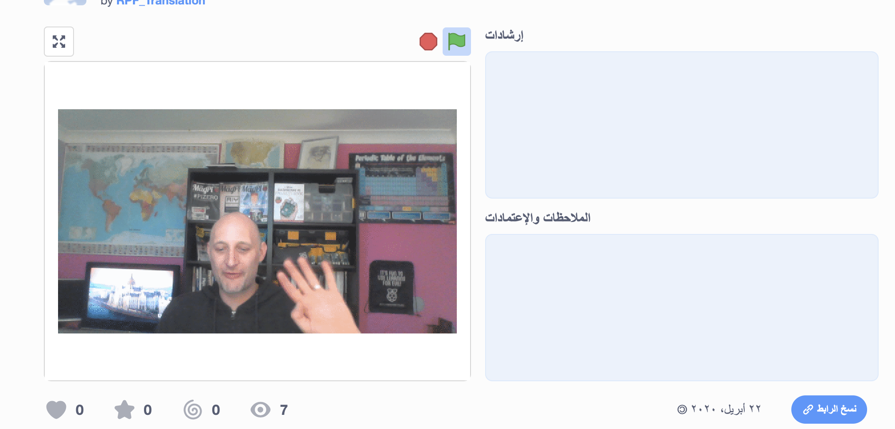

## المقدمة

في هذا المشروع، ستستخدم برنامج Scratch لإنشاء بطاقة إلكترونية سمعية بصرية والتي يمكنك إرسالها إلى الأصدقاء والعائلة.

### ما الذي سوف تصنعه

انقر على العلم الأخضر لرؤية البطاقة إلكترونية. <iframe src="https://scratch.mit.edu/projects/385557938/embed" allowtransparency="true" width="485" height="402" frameborder="0" scrolling="no" allowfullscreen mark="crwd-mark"></iframe>

--- /no-print ---

--- print-only ---  --- /print-only ---

--- collapse ---
---
title: ما الذي سوف تحتاج إليه
---
### الأجهزة

- جهاز كمبيوتر مزود بكاميرا ويب وميكروفون
- إمكانية الإتصال بالإنترنت

### البرامج

- برنامج Scratch 3 (سواء كان [متصل بالإنترنت](http://rpf.io/scratchon) أو [دون إتصال بالإنترنت](http://rpf.io/scratchoff))
- متصفح ويب

--- /collapse ---

--- collapse ---
---
title: ما الذي سوف تتعلمه
---

- كيفية تحويل فيديو إلى ملف GIF
- كيفية جعل ملف GIF في برنامج Scratch متحركاً
- كيفية إضافة صوت مسجل إلى الرسوم المتحركة

--- /collapse ---

--- collapse ---
---
title: معلومات إضافية للمعلمين
---

إذا كنت بحاجة إلى طباعة هذا المشروع، فالرجاء استخدام الإصدار [الصديق للبيئة](https://projects.raspberrypi.org/en/projects/av-e-card/print){:target="_blank"}.

--- /collapse ---
