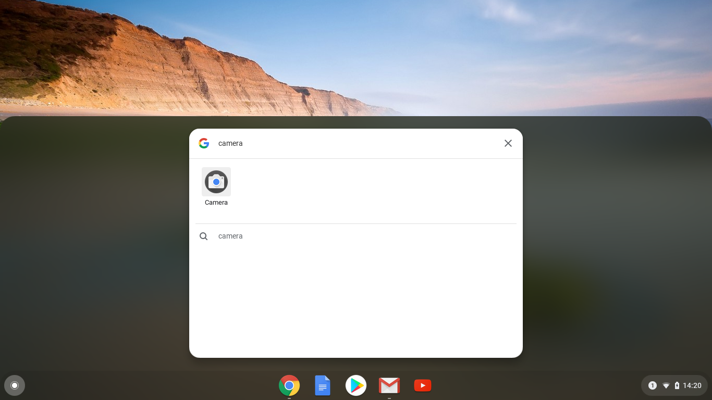

## سجل الفيديو الخاص بك

لا يمكنك إضافة فيديو مسجل إلى Scratch، ولكن يمكنك استيراد ملفات من نوع GIF. عندما تقوم باستيراد ملف GIF على شكل كائن، يقوم Scratch بتقسيم ملف GIF، وتصبح كل صورة GIF مظهراً جديداً للكائن الجديد.

**تذكر أن الفيديو الذي ستقوم بإنشائه سيكون متاحاً للجميع، لذا تأكد من عدم وجود أي شيء يمكن أن يدل على إسمك أو موقعك في اللقطة، ويجب عليك أولاً الحصول على إذن من والديك لإنشاء الفيديو واستخدامه.**

--- task ---

انظر إلى الأقسام المصغرة أدناه لمساعدتك في تسجيل بضع ثوان من الفيديو باستخدام كاميرا الويب الخاصة بالكمبيوتر، ثم احفظ الفيديو على الكومبيوتر.

--- /task ---

--- collapse ---
---

title: تسجيل فيديو بواسطة برنامج كاميرا الويب في Windows

---
- انقر فوق قائمة** ابدأ ** واختر تطبيق **الكاميرا**.

- انقر فوق زر**تسجيل** لتسجيل بضع ثوان من الفيديو.

- يجب أن يظهر الفيديو الخاص بك في مجلد ` الصور/الكاميرا `.

--- /collapse ---

--- collapse ---
---

title: تسجيل فيديو بواسطة برنامج كاميرا الويب في نظام macOS

---
- انتقل إلى قائمة **التطبيقات** الخاصة بك وافتح QuickTime Player.

- انقر فوق **ملف ** > ** تسجيل فيلم جديد**، ثم اسمح بالوصول إلى الكاميرا عند المطالبة بذلك.

- عند الانتهاء، يمكنك حفظ الفيديو الخاص بك، ويجب أن يظهر على سطح المكتب.

--- /collapse ---

--- collapse ---
---

title: تسجيل فيديو بواسطة برنامج كاميرا الويب في Chrome OS

---

- انقر فوق مشغل التطبيق الخاص بك وابحث عن تطبيق **الكاميرا**.

- حدد ** فيديو ** على الجانب الأيمن، ثم انقر فوق زر** تسجيل**.

- عند الانتهاء، انقر فوق زر** التسجل ** مرة أخرى، وستجد ملفك في مجلد ` مقاطع الفيديو`.

--- /collapse ---

الآن أصبح لديك الفيديو، سوف تحتاج لتحويله إلى ملف GIF. الطريقة السهلة للقيام بذلك وهي استخدام الرابط التالي[ rpf.io/gif ](https://rpf.io/gif) {: target = "_ blank"}.

--- task ---

أولاً، قم بتحميل الفيديو الخاص بك: انقر فوق زر ** استعراض **، انقر فوق ملفك، ثم انقر فوق زر ** تحميل**.

--- /task ---

--- task ---

لجعل الأشياء أسرع قليلاً في برنامج Scratch، يجب عليك تحسين ملف GIF. للقيام بذلك، حدد خانة الاختيار** تحسين**. ربما ترغب أيضاً في تقليل الدقة.

--- /task ---

--- task ---

انقر فوق زر **تحويل ** وعند إنشاء ملف GIF، انقر فوق أيقونة ** حفظ ** لحفظ ملف GIF الخاص بك.

 

--- /task ---

--- task ---

عند الإنتهاء، تأكد من وجود ملف GIF في مجلد ` التنزيلات`.

--- /task ---

