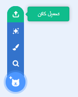
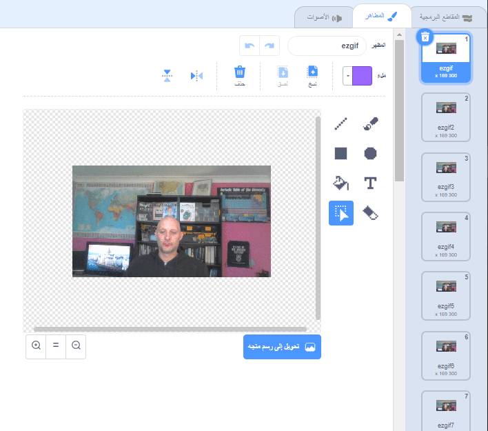

## إضافة وتحريك ملف GIF الخاص بك ببرنامج Scratch

--- task ---

انتقل إلى[rpf.io/scratch-new](https://rpf.io/scratch-new) لفتح مشروع Scratch جديد.

--- /task ---

--- task ---

انقر على رمز **سلة المهملات** لحذف كائن القط.


--- /task ---

--- task ---

الآن، مرر مؤشر الماوس فوق الزر **اختيار كائن**، ثم انقر فوق **تحميل كائن** لتحميل كائن جديد.



--- /task ---

--- task ---

حدد ملف GIF الخاص بك من متصفح الملفات، ثم قم بتحميله.


--- /task ---

--- task ---

انقر على قائمة**المظاهر**لكائنك الجديدة وستشاهد جميع المظاهر الفردية الموجودة في ملف GIF.



دوّن إجمالي عدد المظاهر التي لديك، لأن هذا سيكون مهماً في المهمة التالية.

--- /task ---

--- task ---

لتشغيل ملف GIF، يمكنك استخدام كتلة `كرر `{:class="block3control"}، داخل كتلة `كرر بإستمرار `{:class="block3control"}. عدد التكرارات في كتلة `كرر` يجب أن يتطابق {:class="block3control"} مع عدد المظاهر الموجودة في ملف GIF الذي تم استيراده.

```blocks3
when flag clicked
forever
repeat (35)
next costume
```
--- /task ---

--- task ---

قد تكون الرسوم المتحركة سريعة بعض الشيء، لذا أضف كتلة `انتظر `{:class="block3control"} لإبطائها قليلاً.


```blocks3
when flag clicked
forever
repeat (35)
+wait (0.04) seconds
next costume
```

--- /task ---

--- task ---

قد ترغب أيضاً في زيادة حجم الرسوم المتحركة وإعادة وضعها في وسط المنصة.

```blocks3
when flag clicked
+set size to (150) %
forever
repeat (35)
next costume
```

--- /task ---

--- task ---

من المفيد أيضًا التأكد من بدء تشغيل الرسوم المتحركة من المظهر الأول.

```blocks3
when flag clicked
+switch costume to (ezgif v)
set size to (150) %
forever
repeat (35)
next costume
```

--- /task ---


--- task ---

انقر على العلم الأخضر لمشاهدة الفيديو الذي يتم تشغيله على المنصة.

--- /task ---


