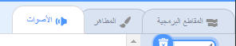
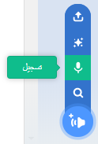
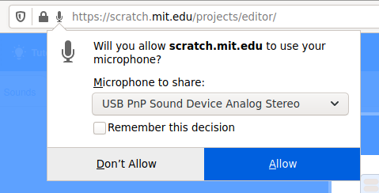
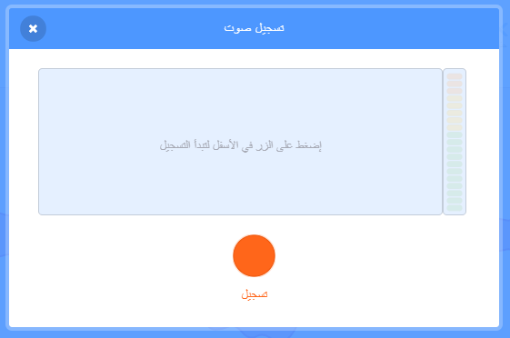

## إضافة الصوت

--- task ---

انقر فوق علامة تبويب **الأصوات** للكائنات.



---/task--

--- task ---

في الزاوية السفلية اليمنى من الشاشة، مرر مؤشر الماوس فوق زر **اختيار صوت** واختر **تسجيل** لتسجيل صوت جديد.



--- /task ---

--- task ---

قد تحتاج لسماح متصفح الويب الخاص بك للوصول إلى الميكروفون. للقيام بذلك، انقر فوق **سماح**.



--- /task ---

--- task ---

انقر فوق زر **تسجل** لتسجيل بضع ثوان من صوتك. عند الإنتهاء من رسالتك الصوتية لمستلم بطاقتك الإلكترونية، انقر فوق **إيقاف التسجيل**، ثم انقر فوق**حفظ**.



--- /task ---

--- task ---

لتشغيل الصوت، يمكنك استخدام كتلة `بث `{:class="block3control"} عندما تبدأ حلقة الرسوم المتحركة.

```blocks3
when flag clicked
switch costume to (ezgif v)
set size to (150) %
forever
+broadcast (message1 v)
repeat (35)
next costume
```

--- /task ---

--- task ---

ثم استخدم كتلة `عندما أتلقى `{:class="block3control"} لبدء تشغيل الصوت.

```blocks3
when I receive (message1 v)
play sound (recording1 v) until done
```

--- /task ---

--- task ---

قد ترغب في استخدام كتلة `انتظر `{:class="block3control"} للتحكم في وقت بدء تشغيل الصوت.

```blocks3
when I receive (message1 v)
+wait (0.4) seconds
play sound (recording1 v) until done
```

--- /task ---


