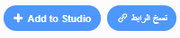

## شارك بطاقتك الإلكترونية مع الأصدقاء والعائلة

الآن بعد انشائك للبطاقتك الإلكترونية السمعية البصرية، فقد حان وقت مشاركتها مع أصدقائك وعائلتك.

--- task ---

تأكد من تسجيل الدخول إلى حسابك في برنامج Scratch، ثم انقر فوق زر **مشاركة **، للسماح للآخرين بعرض مشروعك.

--- /task ---

--- task ---

عند مشاركة مشروعك، انقر فوق زر** شاهد صفحة المشروع**. قد يستغرق هذا بعض الوقت، ريثما يتم تحميل ملف GIF.

--- /task ---

--- task ---

يمكنك الآن نسخ رابط مشروعك ومشاركته عبر البريد الإلكتروني أو من خلال شبكة التواصل الإجتماعية أو عبر منصة الرسائل.

--- /task ---

