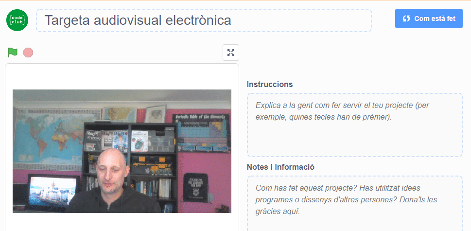

## Introducció

En aquest projecte, faràs servir la plataforma Scratch per fer una targeta audiovisual electrònica que podràs enviar a amics i familiars.

### Què faràs

--- no-print --- Fes clic a la bandera verda per veure la targeta electrònica. <iframe src="https://scratch.mit.edu/projects/419313682/embed" allowtransparency="true" width="485" height="402" frameborder="0" scrolling="no" allowfullscreen mark="crwd-mark"></iframe>

--- /no-print ---

--- print-only ---  --- /print-only ---

--- collapse ---
---
títol: Què necessitaràs
---
### Maquinari

- Un ordinador amb càmera web i micròfon
- Una connexió a Internet

### Programari

- Scratch 3 ([en línia](http://rpf.io/scratchon) o [fora de línia](http://rpf.io/scratchoff))
- Un navegador web

--- /collapse ---

--- collapse ---
---
títol: Què aprendràs
---

- Com convertir un vídeo a un GIF
- Com animar un GIF a Scratch
- Com afegir so gravat a una animació

--- /collapse ---

--- collapse ---
---
títol: Informació addicional per educadors
---

Si necessites imprimir aquest projecte, si us plau, utilitza la [versió per imprimir](https://projects.raspberrypi.org/en/projects/av-e-card/print){:target="_blank"}.

--- /collapse ---
