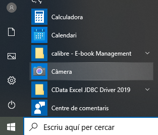
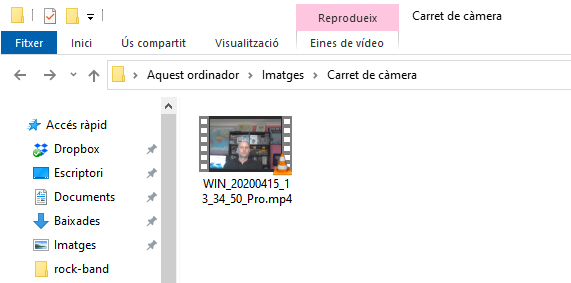
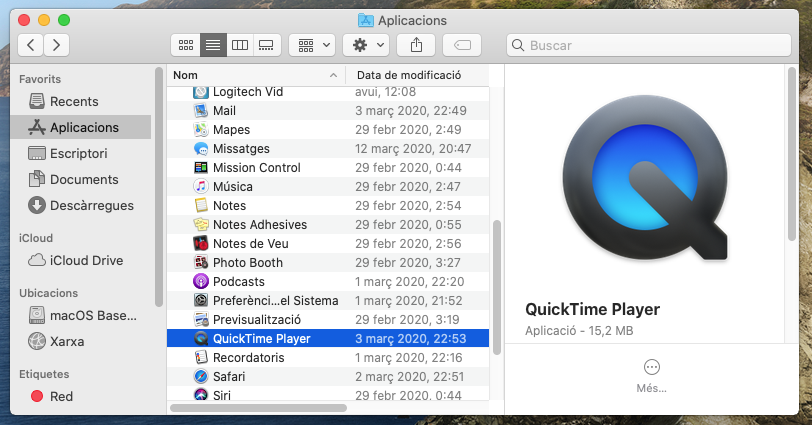
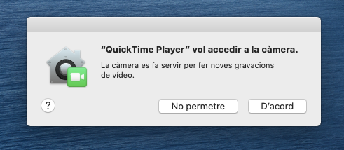
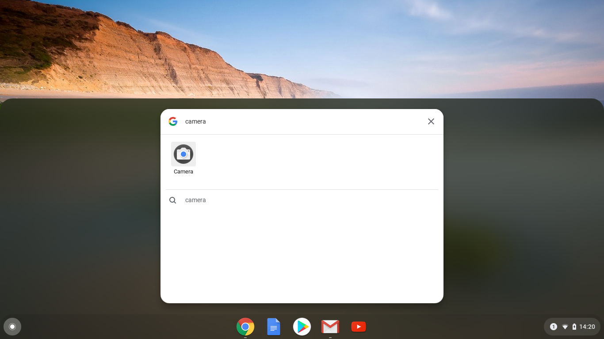
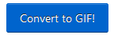

## Grava el teu vídeo

No pots afegir vídeo gravat a Scratch, però pots importar GIFs. Quan importis un GIF com a personatge, Scratch separa el GIF i cada fotograma del GIF es converteix en un nou vestit per al personatge nou.

**Recorda que el vídeo que crearàs serà públic, així que assegura't que no tinguis res que pugui identificar el teu nom o ubicació a la captura, obté primer el permís dels teus pares per crear i utilitzar el vídeo.**

--- task ---

Consulta les seccions desplegades a continuació per ajudar-te a gravar uns segons de vídeo amb la càmera web de l’ordinador i, a continuació, guarda el vídeo a la unitat.

--- /task ---

--- collapse ---
---
title: Gravació de vídeo amb càmera web a Windows
---
- Fes clic al menú **Inici** i selecciona el botó de l'aplicació **Càmera**.

- Fes clic al botó d'**Enregistrar** per gravar uns segons de vídeo.

- El teu vídeo ha d'aparèixer a la teva carpeta `Imatges\Carret de càmera`.

--- /collapse ---

--- collapse ---
---
title: Gravació de vídeo amb càmera web a macOS
---
- Vés al teu menú **Aplicacions** i obre el reproductor QuickTime.

- Fes clic a **Arxiu** > **Nova gravació de vídeo**, llavors permet l'accés a la càmera quan se't demani.

- Quan hagis acabat, pots desar o exportar el vídeo i hauria d'aparèixer a l'escriptori.

--- /collapse ---

--- collapse ---
---
title: Gravació de vídeo amb càmera web a Chrome OS
---

- Fes clic al llançador d’aplicacions i cerca la aplicació de la **Càmera**.

- Selecciona **Vídeo** al costat dret i, a continuació, fes clic al botó d'**Enregistrar**.

- Quan hagis acabat, fes clic al botó d'**Enregistrar** de nou i trobaràs el fitxer a la carpeta `Vídeos`.

--- /collapse ---

Ara que tens el vídeo, has de convertir-lo en GIF. Una manera fàcil de fer-ho és fer servir [el convertidor a rpf.io/gif](https://rpf.io/gif){:target="_blank"}.

--- task ---

Primer, penja el teu vídeo: fes clic a **Tria un fitxer**, fes clic al fitxer i després fes clic al botó **Upload video!**.

--- /task ---

--- task ---

Per fer les coses una mica més ràpides a Scratch, hauríes d’optimitzar el GIF. Per fer-ho, selecciona la casella **Optimize**. També potser t'agradaria reduir la resolució.

--- /task ---

--- task ---

Fes clic a **Convert to GIF!** i quan s'hagi creat el GIF, fes clic a la icona **Save** per desar el GIF.

 

--- /task ---

--- task ---

Quan hagis acabat, comprova que hi ha el GIF a la teva carpeta de `Baixades`.

--- /task ---

