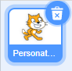
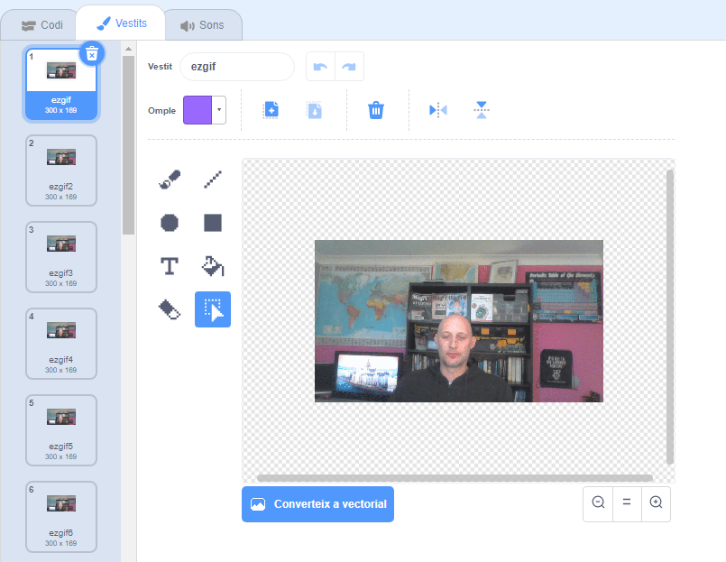

## Com animar un GIF a Scratch

--- task ---

Ves a [rpf.io/scratch-new](https://rpf.io/scratch-new) per obrir un nou projecte a Scratch.

--- /task ---

--- task ---

Fes clic a la icona **Paperera** per esborrar el personatge del gat.



--- /task ---

--- task ---

Ara, passa per sobre del botó **Tria un personatge** i després fes clic a **Puja un personatge** per carregar un de nou.


--- /task ---

--- task ---

Selecciona el teu GIF al navegador de fitxers i, a continuació, carrega'l.


--- /task ---

--- task ---

Fes clic a la pestanya **Vestits** pel teu nou personatge i hauries de veure tots els fotogrames individuals del teu GIF.



Anota el nombre total de vestits que tens, ja que això serà important en la següent tasca.

--- /task ---

--- task ---

Per reproduir el GIF, pots utilitzar un bloc `repeteix` {:class="block3control"}, dins d'un bloc `per sempre`{:class="block3control"}. El bloc `repeteix`{:class="block3control"} hauria de coincidir amb el nombre de fotogrames del GIF importat.

```blocks3
quan la bandera es cliqui
per sempre
repeteix (35)
següent vestit
```
--- /task ---

--- task ---

La teva animació pot ser una mica ràpida, de manera que afegeix un bloc `espera`{:class="block3control"} per alentir-lo una mica.


```blocks3
quan la bandera es cliqui
per sempre
repeteix (35)
+espera (0.04) segons
següent vestit
```

--- /task ---

--- task ---

També potser t'agradaria augmentar la mida de l’animació i reposicionar-la al centre de l’Escenari.

```blocks3
when flag clicked
+set size to (150) %
forever
repeat (35)
+wait (0.04) seconds
next costume
```

--- /task ---

--- task ---

També és útil assegurar-te que sempre començaràs a reproduir l'animació des del primer vestit.

```blocks3
when flag clicked
+switch costume to (ezgif v)
set size to (150) %
forever
repeat (35)
+wait (0.04) seconds
next costume
```

--- /task ---


--- task ---

Fes clic a la bandera verda per veure el teu vídeo reproduït a l'Escenari.

--- /task ---


