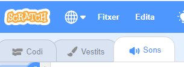
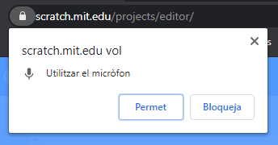
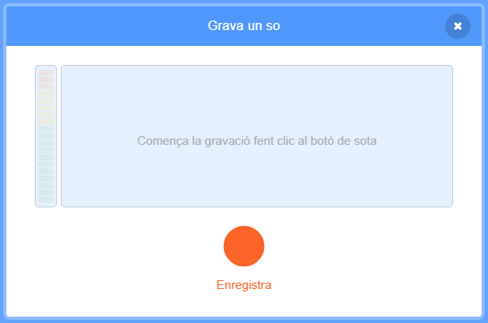

## Afegeix algun so

--- task ---

Fes clic a la pestanya **Sons** del teu personatge.



--- /task ---

--- task ---

A la part inferior esquerra de la pantalla, passa per sobre el botó **Tria un so** i selecciona **Enregistra** per gravar un nou so.


--- /task ---

--- task ---

Potser hauràs de permetre que el teu navegador web accedeixi al teu micròfon. Per fer-ho, fes clic a **Permet**.



--- /task ---

--- task ---

Fes clic al botó **Enregistra** per començar a gravar la teva veu. Quan hagis acabat el teu missatge per al destinatari de la teva targeta electrònica, fes clic a **Atura la gravació** i, a continuació, fes clic a **Desa**.



--- /task ---

--- task ---

Per reproduir el so, pots utilitzar un bloc `envia a tots`{:class="block3control"} quan s'inicia el bucle d'animació.

```blocks3
when green flag clicked
canvia el vestit a (ezgif v)
fixa la mida a (150) %
per sempre
+envia a tots (missatge1 v)
repeteix (35)
següent vestit
```

--- /task ---

--- task ---

Aleshores, utilitza un bloc `quan rebi`{:class="block3control"} per començar a reproduir el so.

```blocks3
quan rebi (missatge1 v)
toca el so (gravació1 v) fins que acabi
```

--- /task ---

--- task ---

És possible que t'agradi fer servir un bloc `espera`{:class="block3control"} per controlar quan comença a reproduir-se el so.

```blocks3
quan rebi (missatge1 v)
+espera (0.4) segons
toca el so (gravació1 v) fins que acabi
```

--- /task ---


