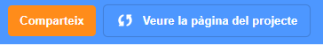
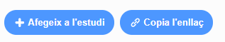

## Comparteix la teva targeta electrònica amb amics i familiars

Ara que has creat la teva targeta electrònica audiovisual, és hora de compartir-la amb els teus amics i familiars.

--- task ---

Assegura't que estàs registrat a Scratch i, a continuació, fes clic al botó **Comparteix** per permetre que altres persones visualitzin el teu projecte.

--- /task ---

--- task ---

Quan el teu projecte s'hagi compartit, fes clic al botó **Veure la pàgina del projecte**. Pot ser que això trigui una mica, ja que cal carregar el GIF.

--- /task ---

--- task ---

Ara pots copiar l’enllaç del teu projecte i compartir-lo per correu electrònic, una xarxa social o una plataforma de missatgeria.

--- /task ---

