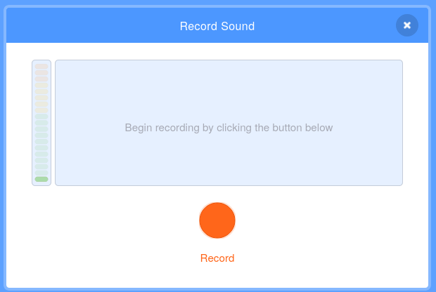

## Add some sound

--- task ---

Click on the **Sounds** tab for your sprite.


--- /task ---

--- task ---

In the bottom left-hand corner of the screen, hover over the **Choose a Sound** button and select **Record** to record a new sound.


--- /task ---

--- task ---

You might have to allow your web browser to access your microphone. To do this, click on **Allow**.


--- /task ---

--- task ---

Click the **Record** button to start recording your voice. When you have finished your message for the recipient of your e-card, click on **Stop recording**, then click on **Save**.



--- /task ---

--- task ---

To play the sound, you can use a `broadcast`{:class="block3control"} block when the animation loop starts.

```blocks3
when flag clicked
switch costume to (ezgif v)
set size to (150) %
forever
+broadcast (message1 v)
repeat (35)
+wait (0.04) seconds
next costume
```

--- /task ---

--- task ---

Then, use a `when I receive`{:class="block3control"} block to start playing the sound.

```blocks3
when I receive (message1 v)
play sound (recording1 v) until done
```

--- /task ---

--- task ---

You might like to use a `wait`{:class="block3control"} block to control when the sound starts being played.

```blocks3
when I receive (message1 v)
+wait (0.4) seconds
play sound (recording1 v) until done
```

--- /task ---


