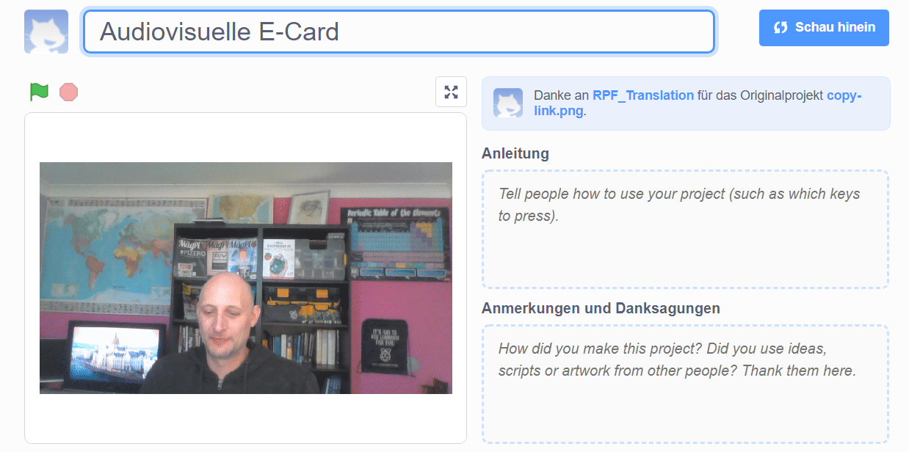

## Einleitung

In diesem Projekt verwendest du die Scratch-Plattform, um eine audiovisuelle E-Card zu erstellen, die du an Freunde und Familie senden kannst.

### Was du machen wirst

--- no-print --- Klicke auf die grüne Flagge, um die Animation zu sehen. <iframe src="https://scratch.mit.edu/projects/385557938/embed" allowtransparency="true" width="485" height="402" frameborder="0" scrolling="no" allowfullscreen mark="crwd-mark"></iframe>

--- /no-print ---

--- print-only ---  --- /print-only ---

--- collapse ---
---
title: Was du brauchen wirst
---
### Hardware

- Ein Computer mit einer Webcam und einem Mikrofon
- Eine Internetverbindung

### Software

- Scratch 3 (entweder [online](http://rpf.io/scratchon) oder [offline](http://rpf.io/scratchoff))
- Einen Webbrowser

--- /collapse ---

--- collapse ---
---
title: Was du lernen wirst
---

- So konvertierst du ein Video in ein GIF
- So animierst du ein GIF in Scratch
- So fügst du einer Animation einen aufgenommenen Sound hinzu

--- /collapse ---

--- collapse ---
---
title: Zusätzliche Informationen für Pädagogen
---

Wenn du dieses Projekt ausdrucken möchtest, verwende die [druckerfreundliche Version](https://projects.raspberrypi.org/en/projects/av-e-card/print){:target="_blank"}.

--- /collapse ---
