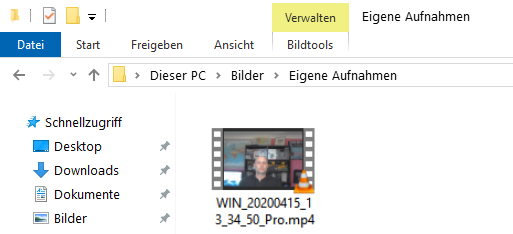
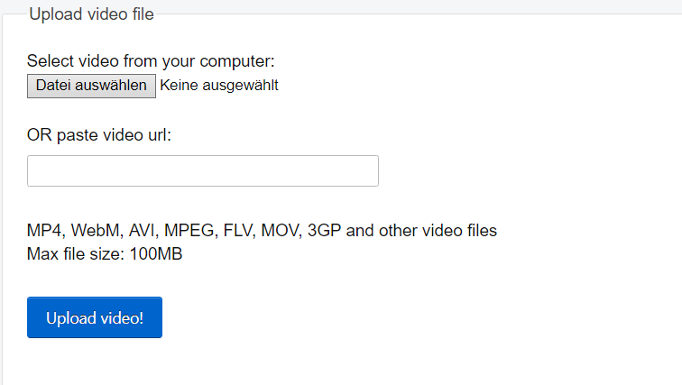

## Nimm dein Video auf

Du kannst in Scratch keine aufgezeichneten Videos hinzufügen, aber du kannst GIFs importieren. Wenn du ein GIF als Figur importierst, zerlegt Scratch das GIF und jedes Frame des GIFs wird zu einem neuen Kostüm für die neue Figur.

**Denke daran, dass das Video, das du erstellen möchtest, öffentlich ist. Stelle daher sicher, dass es nichts gibt, was deinen Namen oder Ort in der Aufnahme identifizieren könnte, und hole dir zuerst die Erlaubnis deiner Eltern ein, das Video zu erstellen und zu verwenden.**

--- task ---

Sieh dir die eingeklappten Abschnitte unten an, um einige Sekunden des Videos mit der Webcam deines Computers aufzunehmen, und speichere das Video dann auf deinem Laufwerk.

--- /task ---

--- collapse ---
---

Titel: Aufnahme von Webcam-Videos unter Windows

---
- Klicke auf das **Start** Menü und wähle die **Kamera** App.

- Klicke auf die **Video aufnehmen** Taste, um einige Sekunden des Videos aufzunehmen.

- Dein Video sollte im Ordner `Bilder\Eigene Aufnahmen` angezeigt werden.

--- /collapse ---

--- collapse ---
---

Titel: Aufnahme von Webcam-Videos unter Windows

---
- Gehe zum Menü ** Anwendungen** und öffne den QuickTime Player.

- Klicke auf **Datei** > **Neue Filmaufnahme**. Ermögliche dann den Zugriff auf die Kamera, wenn du dazu aufgefordert wirst.

- Wenn du fertig bist, kannst du dein Video speichern oder exportieren. Es sollte auf deinem Desktop angezeigt werden.

--- /collapse ---

--- collapse ---
---

Titel: Aufnahme von Webcam-Videos unter Chrome OS

---

- Klicke auf deinen Anwendungsstarter und suche nach der **Kamera** App.

- Wähle **Video** auf der rechten Seite aus und klicke dann die **Aufnehmen** Taste.

- Wenn du fertig bist, klicke noch einmal auf die **Aufnehmen** Taste und du findest deine Datei in dem Ordner `Videos `.

--- /collapse ---

Nachdem du das Video hast, musst du es in ein GIF konvertieren. Eine einfache Möglichkeit, dies zu tun, besteht darin, den Konverter [unter rpf.io/gif](https://rpf.io/gif){:target = "_ blank"} zu verwenden.

--- task ---

Lade zuerst dein Video hoch: Klicke auf **Durchsuchen**, dann auf deine Datei und anschließend auf die ** Hochladen ** Schaltfläche.

--- /task ---

--- task ---

Um die Arbeit in Scratch etwas zu beschleunigen, solltest du das GIF optimieren. Wähle dazu das **Optimieren** Kontrollkästchen. Möglicherweise möchtest du auch die Auflösung reduzieren.

--- /task ---

--- task ---

Klicke auf die **Konvertieren** Schaltfläche und wenn das GIF erstellt wurde, klicke auf das **Speichern** Symbol, um dein GIF zu speichern.

 

--- /task ---

--- task ---

Wenn du fertig bist, überprüfe den `Downloads` Ordner auf das GIF.

--- /task ---

