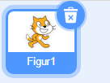

## Füge dein GIF zu Scratch hinzu und animiere es

--- task ---

Navigiere zu [rpf.io/scratch-new](https://rpf.io/scratch-new), um ein neues Scratch-Projekt zu öffnen.

--- /task ---

--- task ---

Klicke auf das **Papierkorb**-Symbol, um die aktuelle Katzenfigur zu löschen.



--- /task ---

--- task ---

Bewege den Mauszeiger nun über die **Wähle ein Figur** Schaltfläche und klicke dann auf **Figur hochladen**, um eine neue Figur hochzuladen.


--- /task ---

--- task ---

Wähle dein GIF im Dateibrowser aus und lade es hoch.


--- /task ---

--- task ---

Klicke auf den Reiter **Kostüme** für deine neue Figur und du solltest alle einzelnen Frames in deinem GIF sehen.


Notiere dir die Gesamtzahl der Kostüme, die du hast, da dies bei der nächsten Aufgabe wichtig sein wird.

--- /task ---

--- task ---

Um das GIF durchzuspielen, kannst du einen `wiederhole`{:class="block3control"} Block in einem `wiederhole fortlaufend`{:class="block3control"} Block verwenden. Der `wiederhole`{:class="block3control"} - Block sollte mit der Anzahl der Frames aus dem importierten GIF übereinstimmen.

```blocks3
when flag clicked
forever
repeat (35)
next costume
```
--- /task ---

--- task ---

Deine Animation ist möglicherweise etwas schnell, füge also einen `warte`{:class="block3control"} Block hinzu, um es etwas zu verlangsamen.


```blocks3
when flag clicked
wiederhole fortlaufend 
wiederhole (35) mal
+warte (0.04) Sekunden
wechsle zum nächsten Kostüm
```

--- /task ---

--- task ---

Du kannst die Animation auch vergrößern und in der Mitte der Bühne neu positionieren.

```blocks3
when flag clicked
+ setze Größe auf (150)%
wiederhole fortlaufend
wiederhole (35) mal
wechsle zum nächsten Kostüm
```

--- /task ---

--- task ---

Es ist auch hilfreich sicherzustellen, dass du die Animation immer vom ersten Kostüm an abspielst.

```blocks3
when flag clicked
+wechsle zu Kostüm (ezgif v)
setze Größe auf (150) %
wiederhole fortlaufend
wiederhole (35) mal
wechsle zum nächsten Kostüm
```

--- /task ---


--- task ---

Klicke auf die grüne Flagge, um zu sehen, wie dein Video auf der Bühne abgespielt wird.

--- /task ---


