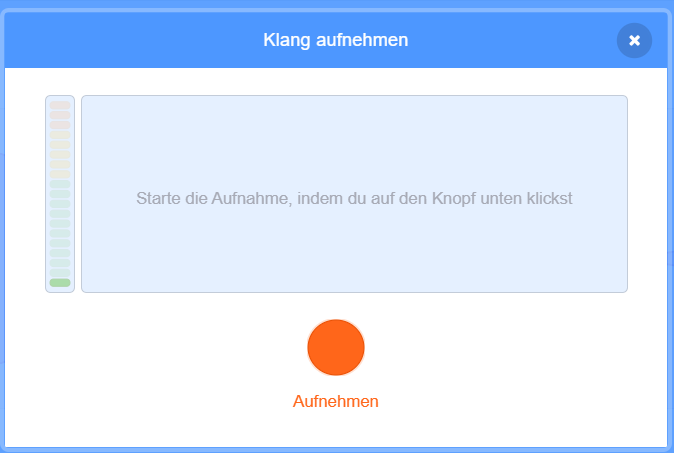

## Füge einen Ton hinzu

--- task ---

Klicke auf die Registerkarte **Töne** für deine Figur.


--- /task ---

--- task ---

Bewege den Mauszeiger in der unteren linken Ecke des Bildschirms über die **Klang wählen** Schaltfläche und wählen dann **Aufnehmen** um einen neuen Sound aufzunehmen.


--- /task ---

--- task ---

Möglicherweise musst du deinem Webbrowser erlauben, auf dein Mikrofon zuzugreifen. Klicke dazu auf **Zulassen**.


--- /task ---

--- task ---

Klicke auf die **Aufnehmen** Taste, um deine Stimme aufzunehmen. Wenn du deine Nachricht für den Empfänger deiner E-Card beendet hast, klicke auf **Aufnahme beenden** und klicke dann auf **Speichern**.



--- /task ---

--- task ---

Um den Sound abzuspielen, kannst du einen `sende an alle`{:class="block3control"} Block hinzufügen, wenn die Animationsschleife startet.

```blocks3
Wenn Flagge angeklickt wird
wechsle zu Kostüm (ezgiv v)
setze Größe auf (150) %
wiederhole fortlaufend
+sende (Nachricht1 v) an alle 
wiederhole (35) mal
wechsle zum nächstes Kostüm
```

--- /task ---

--- task ---

Verwende dann einen `Wenn ich empfange`{:class="block3control"} Block, um den Ton abzuspielen.

```blocks3
Wenn ich (Nachricht1 v) empfange
spiele Klang (Aufnahme1 v) ganz
```

--- /task ---

--- task ---

Möglicherweise möchtest du auch `warte`{:class="block3control"} Blöcke nutzen, um zu kontrollieren wann der Ton abgespielt wird.

```blocks3
Wenn ich (Nachricht1 v) empfange
+warte (0,4) Sekunden
spiele Klang (Aufnahme1 v) ganz
```

--- /task ---


