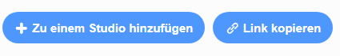

## Teile deine E-Card mit Freunden und Familie

Nachdem du eine audiovisuelle E-Card erstellt hast, kannst du sie mit deinen Freunden und deiner Familie teilen.

--- task ---

Stelle sicher, dass du in Scratch eingeloggt bist, dann klicke auf die **Teilen** Schaltfläche, damit andere deine Projekt ansehen können.

--- /task ---

--- task ---

Wenn dein Projekt freigegeben wurde, klicke auf die Schaltfläche **Projektseite ansehen**. Dies kann einige Zeit dauern, da das GIF hochgeladen werden muss.

--- /task ---

--- task ---

Du kannst den Link für dein Projekt jetzt kopieren und per E-Mail, über ein soziales Netzwerk oder über eine Messaging-Plattform freigeben.

--- /task ---

***
Dieses Projekt wurde von freiwilligen Helfern übersetzt:

Nicole Rotarius

Dennis Weber

Dank freiwilliger Helfer können wir Menschen auf der ganzen Welt die Möglichkeit geben, in ihrer eigenen Sprache zu lernen. Du kannst uns helfen, mehr Menschen zu erreichen, indem Du dich freiwillig zum Übersetzen meldest - weitere Informationen unter [rpf.io/translate](https://rpf.io/translate).

