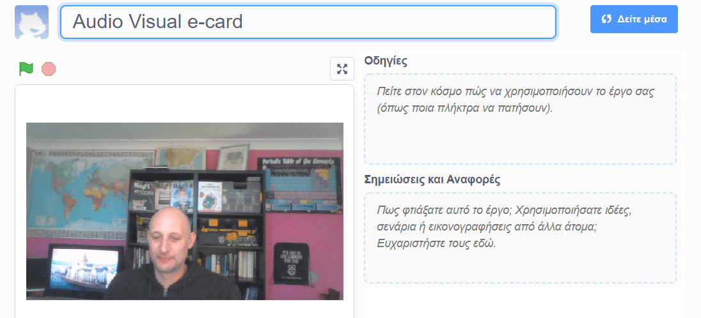

## Εισαγωγή

Σε αυτό το έργο, θα χρησιμοποιήσεις την πλατφόρμα Scratch για να δημιουργήσεις μια οπτικοακουστική ηλεκτρονική κάρτα που μπορείς να στείλεις σε φίλους και συγγενείς.

### Τι θα φτιάξεις

--- no-print --- Κάνε κλικ στην πράσινη σημαία για να δεις την ηλεκτρονική κάρτα. <iframe src="https://scratch.mit.edu/projects/419313682/embed" allowtransparency="true" width="485" height="402" frameborder="0" scrolling="no" allowfullscreen mark="crwd-mark"></iframe>

--- /no-print ---

--- print-only ---  --- /print-only ---

--- collapse ---
---
title: Τι θα χρειαστείς
---
### Υλικό

- Έναν υπολογιστή με κάμερα και μικρόφωνο
- Σύνδεση στο διαδίκτυο

### Λογισμικό

- Scratch 3 (είτε [σε σύνδεση](http://rpf.io/scratchon) είτε [εκτός σύνδεσης](http://rpf.io/scratchoff))
- Ένα πρόγραμμα περιήγησης ιστού

--- /collapse ---

--- collapse ---
---
title: Τι θα μάθεις
---

- Πώς να μετατρέπεις ένα βίντεο σε GIF
- Πώς να δίνεις ζωή σε ένα GIF στο Scratch
- Πώς να προσθέσεις εγγεγραμμένο ήχο σε μια κινούμενη εικόνα

--- /collapse ---

--- collapse ---
---
title: Πρόσθετες πληροφορίες για εκπαιδευτικούς
---

Αν χρειαστεί να εκτυπώσεις αυτό το έργο, χρησιμοποίησε την [εκτυπώσιμη έκδοση](https://projects.raspberrypi.org/en/projects/av-e-card/print)"{:target="_blank"}.

--- /collapse ---
