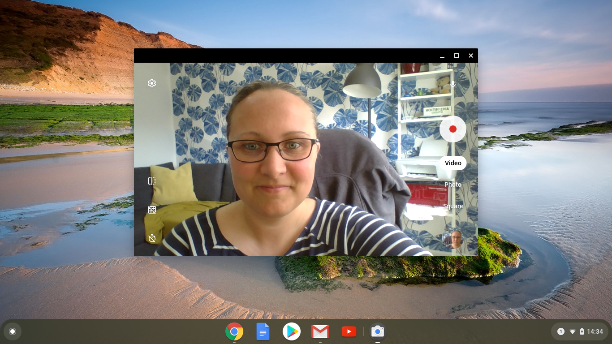

## Κατέγραψε το βίντεό σου

Δεν μπορείς να προσθέσεις μαγνητοσκοπημένο βίντεο στο Scratch, αλλά μπορείς να εισαγάγεις GIF. Όταν εισάγεις ένα GIF ως αντικείμενο, το Scratch κομματιάζει το GIF και κάθε πλαίσιο του GIF γίνεται μια νέα ενδυμασία για το νέο αντικείμενο.

**Να θυμάσαι ότι το βίντεο που πρόκειται να δημιουργήσεις θα είναι δημόσιο, οπότε βεβαιώσου ότι δεν έχεις τίποτα που θα μπορούσε να προσδιορίσει το όνομα ή την τοποθεσία σου στη λήψη και πρώτα να πάρεις άδεια από τους γονείς σου για να δημιουργήσεις και να χρησιμοποιήσεις το βίντεο.**

--- task ---

Κοίταξε τα αναδιπλωμένα τμήματα παρακάτω που θα σε βοηθήσουν να εγγράψεις μερικά δευτερόλεπτα βίντεο χρησιμοποιώντας την κάμερα web του υπολογιστή σου και στη συνέχεια να αποθηκεύσεις το βίντεο στη μονάδα δίσκου σου.

--- /task ---

--- collapse ---
---
title: Εγγραφή βίντεο με την κάμερα στα Windows
---

- Κάνε κλικ στο μενού **Έναρξη** και επέλεξε την εφαρμογή **Κάμερα**.

- Κάνε κλικ στο κουμπί **Εγγραφή** για να ξεκινήσεις την εγγραφή λίγων λεπτών βίντεο.

- Το βίντεό σου θα πρέπει να εμφανίζεται στον φάκελο `Εικόνες\Φιλμ κάμερας`.

--- /collapse ---

--- collapse ---
---
title: Εγγραφή βίντεο με την κάμερα στα macOS
---

- Μετακινήσου στο μενού **Εφαρμογές** και άνοιξε το QuickTime Player.

- Κάνε κλικ στο **Αρχείο**> **Νέα εγγραφή βίντεο**, και στη συνέχεια δώσε πρόσβαση στην κάμερα, όταν σου ζητηθεί.

- Όταν τελειώσεις, μπορείς να αποθηκεύσεις ή να εξάγεις το βίντεό σου και θα πρέπει να εμφανίζεται στον υπολογιστή σου.

--- /collapse ---

--- collapse ---
---
title: Εγγραφή βίντεο με την κάμερα στο Chrome OS
---

- Κάνε κλικ στην εκκινητή εφαρμογών και αναζήτησε για την εφαρμογή **Κάμερα**.

- Επέλεξε **Βίντεο** στη δεξιά πλευρά, και στη συνέχεια, κάνε κλικ στο κουμπί **Εγγραφή**.

- Όταν τελειώσεις, κάνε κλικ ξανά στο κουμπί **Εγγραφή**, και θα βρείτε το αρχείο σου στον φάκελο `Βίντεο`.

--- /collapse ---

Τώρα που έχεις το βίντεο, πρέπει να το μετατρέψεις σε GIF. Ένας εύκολος τρόπος για να το κάνεις αυτό είναι να χρησιμοποιήσεις [τον μετατροπέα στο rpf.io/gif](https://rpf.io/gif){:target="_blank"}.

--- task ---

Αρχικά, μεταφορτώστε το βίντεό σου: κάνε κλικ στο κουμπί **Αναζήτηση**, κάνε κλικ στο αρχείο σου και στη συνέχεια κάνε κλικ στο κουμπί **Μεταφόρτωση**.

--- /task ---

--- task ---

Για να κάνεις τα πράγματα λίγο πιο γρήγορα στο Scratch, θα πρέπει να βελτιστοποιήσεις το GIF. Για να το κάνεις αυτό, επέλεξε το πλαίσιο ελέγχου **Βελτιστοποίηση**. Ίσως να θέλεις επίσης να μειώσεις την ανάλυση.

--- /task ---

--- task ---

Κάνε κλικ στο κουμπί **Μετατροπή**, και όταν δημιουργηθεί το GIF, κάνε κλικ στο εικονίδιο **Αποθήκευση** για να αποθηκεύσεις το GIF σου.

 

--- /task ---

--- task ---

Όταν τελειώσεις, έλεγξε τον φάκελο `Λήψεις μου` για το GIF.

--- /task ---

