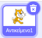
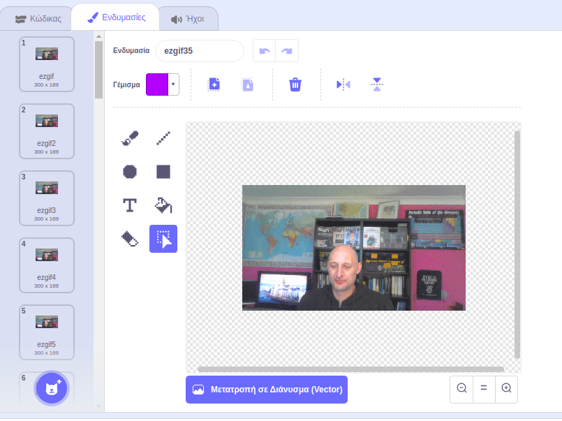

## Πρόσθεσε και ζωντάνεψε το GIF σου στο Scratch

--- task --

Επισκέψου την ιστοσελίδα [rpf.io/scratch-new](https://rpf.io/scratch-new) για να ανοίξεις ένα νέο έργο Scratch.

--- /task ---

--- task ---

Κάνε κλικ στο εικονίδιο **Απορρίμματα** για να διαγράψεις το προεπιλεγμένο αντικείμενο Scratch, τη γάτα.



--- /task ---

--- task ---

Τώρα, τοποθέτησε το δείκτη του ποντικιού πάνω από το κουμπί **Επιλέξτε ένα αντικείμενο**, και στη συνέχεια, κάνε κλικ στο **Μεταφόρτωση αντικειμένου** για να μεταφορτώσεις ένα νέο αντικείμενο.


--- /task ---

--- task ---

Επίλεξε το GIF από το πρόγραμμα περιήγησης αρχείων και στη συνέχεια κάνε τη μεταφόρτωση.


--- /task ---

--- task ---

Κάνοντας κλικ στην καρτέλα **Ενδυμασίες** για το νέο σου αντικείμενο θα πρέπει να βλέπεις όλα τα μεμονωμένα καρέ από το GIF σου.



Σημείωσε τον συνολικό αριθμό των ενδυμασιών που έχεις, καθώς αυτό θα είναι σημαντικό στην επόμενη εργασία.

--- /task ---

--- task ---

Για να παίξεις με το GIF μπορείς να χρησιμοποιήσεις ένα μπλοκ `επανάληψης`{:class="block3control"}, μέσα σε ένα μπλοκ `για πάντα`{:class="block3control"}. Το μπλοκ `επανάληψης`{:class="block3control"} πρέπει να αντιστοιχεί στον αριθμό των καρέ από το GIF που έχει εισαχθεί.

```blocks3
when flag clicked
forever
repeat (35)
next costume
```
--- /task ---

--- task ---

Η κινούμενη εικόνα σου μπορεί να είναι λίγο γρήγορη, οπότε πρόσθεσε ένα μπλοκ `περίμενε`{:class="block3control"} για να την επιβραδύνει λίγο.


```blocks3
when flag clicked
forever
repeat (35)
+wait (0.04) seconds
next costume
```

--- /task ---

--- task ---

Ίσως επίσης να θέλεις να αυξήσεις το μέγεθος της κινούμενης εικόνας και να την επανατοποθετήσεις στο κέντρο της σκηνής.

```blocks3
when flag clicked
+set size to (150) %
forever
repeat (35)
next costume
```

--- /task ---

--- task ---

Είναι επίσης χρήσιμο να βεβαιωθείς ότι αρχίζεις πάντα την αναπαραγωγή της κινούμενης εικόνας από την πρώτη ενδυμασία.

```blocks3
when flag clicked
+switch costume to (ezgif v)
set size to (150) %
forever
repeat (35)
next costume
```

--- /task ---


--- task ---

Κάνε κλικ στην πράσινη σημαία για να παρακολουθήσεις το βίντεό σου να παίζει στη σκηνή.

--- /task ---


