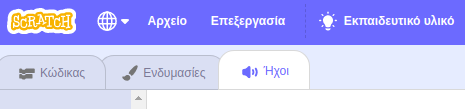
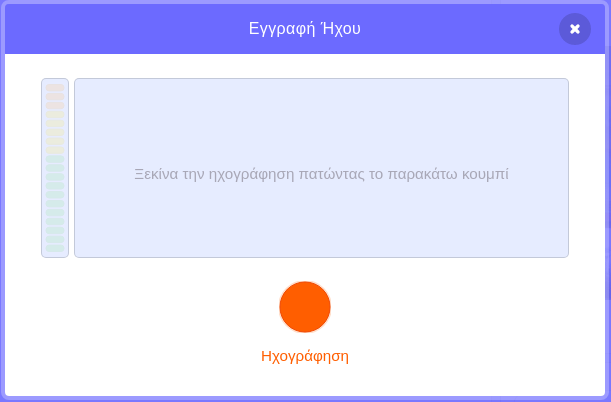

## Πρόσθεσε λίγο ήχο

--- task --

Κάνε κλικ στην καρτέλα **Ήχοι** για το αντικείμενό σου.



--- /task ---

--- task ---

Στην κάτω αριστερή γωνία της οθόνης, τοποθέτησε το δείκτη του ποντικιού πάνω από το κουμπί **Επιλογή ήχου** και επίλεξε **Εγγραφή** για εγγραφή νέου ήχου.


--- /task ---

--- task ---

Ίσως χρειαστεί να επιτρέψεις στο πρόγραμμα περιήγησης ιστού να έχει πρόσβαση στο μικρόφωνό σου. Για να το κάνεις αυτό, κάνε κλικ στο **Να επιτρέπεται**.


--- /task ---

--- task ---

Κάνε κλικ στην **Εγγραφή** για να ξεκινήσεις την εγγραφή της φωνής σου. Όταν ολοκληρώσεις το μήνυμά σου για τον παραλήπτη της ηλεκτρονικής σου κάρτας, κάνε κλικ στη **Διακοπή εγγραφής** και μετά κάνε κλικ στην **Αποθήκευση**.



--- /task ---

--- task ---

Για αναπαραγωγή του ήχου, μπορείς να χρησιμοποιήσεις ένα μπλοκ `εκπομπής`{:class="block3control"} όταν ξεκινά ο βρόχος κίνησης.

```blocks3
when flag clicked
switch costume to (ezgif v)
set size to (150) %
forever
+broadcast (message1 v)
repeat (35)
+wait (0.04) seconds
next costume
```

--- /task ---

--- task ---

Στη συνέχεια, χρησιμοποίησε ένα μπλοκ `όταν λάβω`{:class="block3control"} για να ξεκινήσει η αναπαραγωγή του ήχου.

```blocks3
όταν λαμβάνω (μήνυμα1 v)
ήχος αναπαραγωγής (εγγραφή1 v) έως ότου ολοκληρωθεί
```

--- / task ---

--- task ---

Ίσως θέλεις να χρησιμοποιήσεις ένα μπλοκ `περίμενε`{:class="block3control"} για τον έλεγχο της έναρξης αναπαραγωγής του ήχου.

```blocks3
when I receive (message1 v)
+wait (0.4) seconds
play sound (recording1 v) until done
```

--- /task ---


