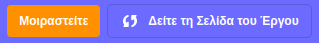

## Διαμοιράσου την ηλεκτρονική σου κάρτα με φίλους και συγγενείς

Τώρα που έχεις δημιουργήσει την οπτικοακουστική ηλεκτρονική κάρτα σου, ήρθε η ώρα να την διαμοιράσεις με τους φίλους και την οικογένειά σου.

--- task ---

Βεβαιώσου ότι είσαι συνδεδεμένος στο Scratch και, στη συνέχεια, κάνε κλικ στο κουμπί **Μοιραστείτε**, για να επιτρέψεις σε άλλους να βλέπουν το έργο σου.

--- /task ---

--- task ---

Όταν γίνει κοινή χρήση του έργου σου, κάντε κλικ στο κουμπί **Δείτε τη σελίδα έργου **. Αυτό μπορεί να διαρκέσει λίγο, καθώς το GIF πρέπει να φορτωθεί.

--- /task ---

--- task ---

Τώρα μπορείς να αντιγράψεις τον σύνδεσμο του έργου σου και να τον μοιραστείς μέσω email, κοινωνικών δικτύων ή πλατφόρμας ανταλλαγής μηνυμάτων.

--- /task ---

***
Το έργο αυτό μεταφράστηκε από τους εθελοντές:

Ευστάθιος Ιωσηφίδης

Κυριακή Ιντζεΐδου

Χάρη στους εθελοντές, μπορούμε να δώσουμε σε ανθρώπους σε όλο τον κόσμο την ευκαιρία να μάθουν στη γλώσσα τους. Μπορείτε να μας βοηθήσετε να προσεγγίσουμε περισσότερους ανθρώπους μεταφράζοντας εθελοντικά - περισσότερες πληροφορίες στο [rpf.io/translate](https://rpf.io/translate).

