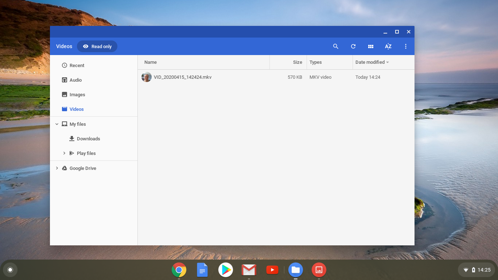

## Recording your video

You can't add recorded video to Scratch, but you can import GIFs. When you import a GIF as a Sprite, Scratch breaks the GIF up, with each frame of the GIF being a new costume of the new Sprite.

**Don't forget that the video you are going to create will be public, so make sure you have nothing that can identify your name or location in the shot, and get parental permission to use the video first**

--- task ---

Look at the collapsed sections below to see how to record a few seconds of video using your computer's webcam, then record a video and save it to your drive.

--- /task ---

--- collapse ---
---

title: Recording webcam video on Windows

---
- Click on the Start menu and choose the **Camera** app.

- Click on the Record button to record a few seconds of video

- Your video should appear in your `Pictures\Camera Roll` folder.

--- /collapse ---

--- collapse ---
---

title: Recording webcam video on macOS

---
- Open up QuickTime player from your application menu.

- Click on `File` > `New Movie Recording`, then allow access to the camera when prompted.

- Once you are finished you can save or export your video, and it should appear on your desktop.

--- /collapse ---

--- collapse ---
---

title: Recording webcam video on Chrome OS

---

- Click on you application launcher and search for the **camera app**

- Select **Video** on the right hand side and then click on the record button.

- Hit the record button again when you are finished and you will find your file in the Videos folder.

--- /collapse ---

Now that you have the video, it needs converting to a GIF. [https://ezgif.com/video-to-gif](https://ezgif.com/video-to-gif){:target="_blank"} is an easy way to do this.

--- task ---

Upload your video by using the **Browse** button, followed by the **Upload** button.

--- /task ---

--- task ---

To make things a little faster in Scratch, you should optimise the GIF, by choosing the **Optimise** checkbox. You might also like to reduce the resolution.

--- /task ---

--- task ---

Click on the **Convert** button, and when the GIF has been created you can click on the **Save** icon to save your GIF.

--- /task ---

--- task ---

Check your **Downloads** folder for the GIF once you have finished.

--- /task ---

