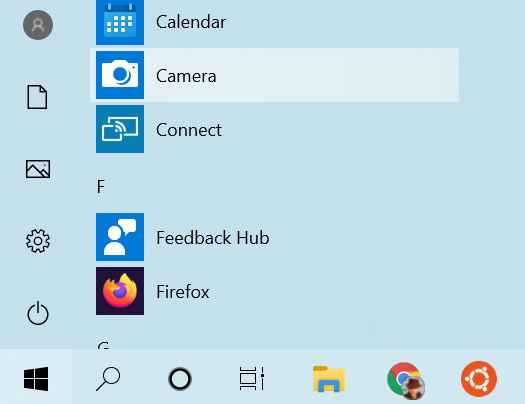
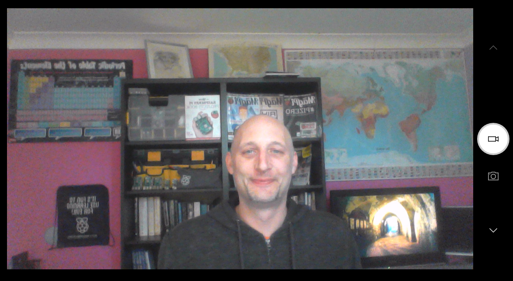

## Record your video

You can't add recorded video to Scratch, but you can import GIFs. When you import a GIF as a sprite, Scratch breaks the GIF up, and each frame of the GIF becomes a new costume for the new sprite.

**Remember that the video you are going to create will be public, so make sure you have nothing that could identify your name or location in the shot, and get permission from your parents to create and use the video first.**

--- task ---

Look at the collapsed sections below to help you record a few seconds of video using your computer's webcam, then save the video to your drive.

--- /task ---

--- collapse ---
---

title: Recording webcam video on Windows

---
- Click on the **Start** menu and choose the **Camera** app.

- Click the **Record** button to record a few seconds of video.

- Your video should appear in your `Pictures\Camera Roll` folder.

--- /collapse ---

--- collapse ---
---

title: Recording webcam video on macOS

---
- Go to your **Applications** menu and open QuickTime Player.

- Click on **File** > **New Movie Recording**, then allow access to the camera when prompted.

- Once you have finished, you can save or export your video, and it should appear on your desktop.

--- /collapse ---

--- collapse ---
---

title: Recording webcam video on Chrome OS

---

- Click on your application launcher and search for the **Camera** app.

- Select **Video** on the right-hand side, and then click the **Record** button.

- When you have finished, click the **Record** button again, and you will find your file in the `Videos` folder.

--- /collapse ---

Now that you have the video, you need to convert it to a GIF. An easy way to do this is to use [the converter at rpf.io/gif](https://rpf.io/gif){:target="_blank"}.

--- task ---

First, upload your video: click the **Browse** button, click on your file, then click the **Upload** button.

--- /task ---

--- task ---

To make things a little faster in Scratch, you should optimise the GIF. To do this, select the **Optimize** checkbox. You might also like to reduce the resolution.

--- /task ---

--- task ---

Click the **Convert** button, and when the GIF has been created, click on the **Save** icon to save your GIF.

--- /task ---

--- task ---

When you have finished, check your `Downloads` folder for the GIF.

--- /task ---

