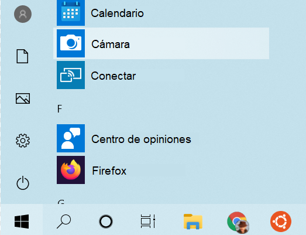
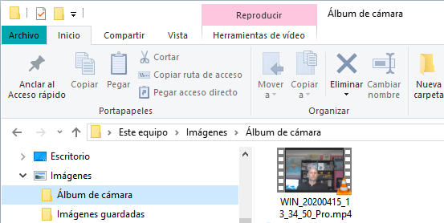
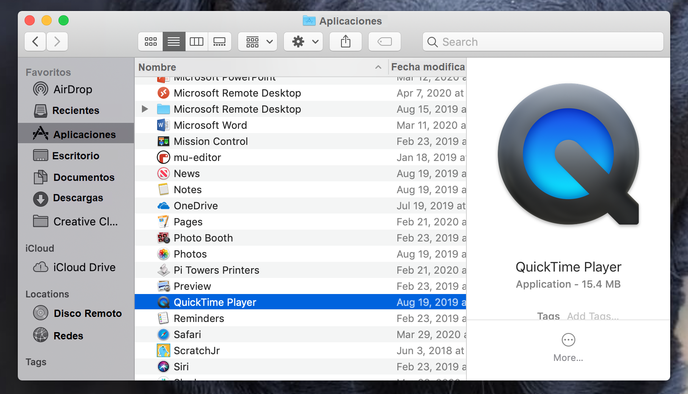
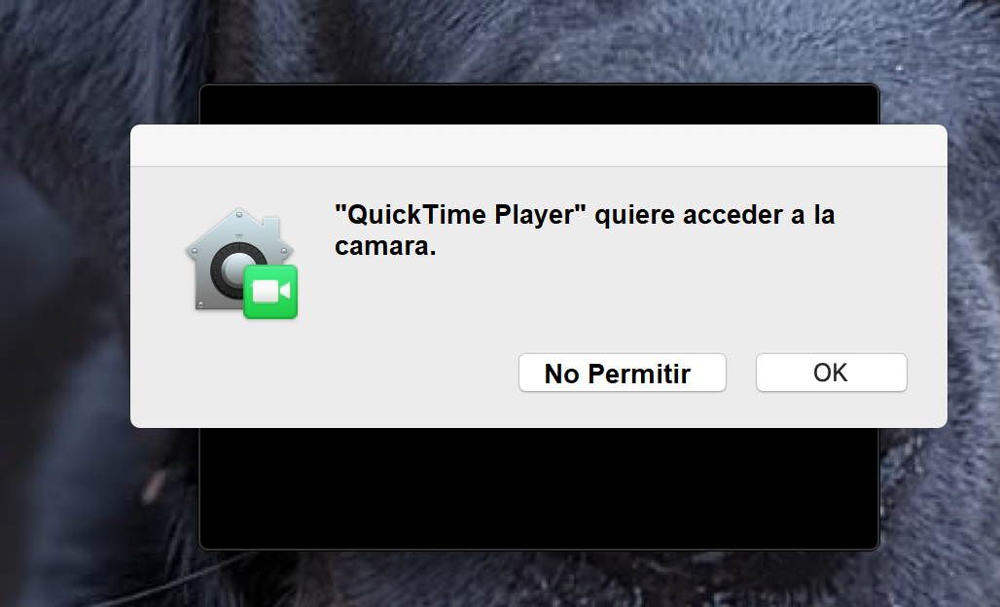
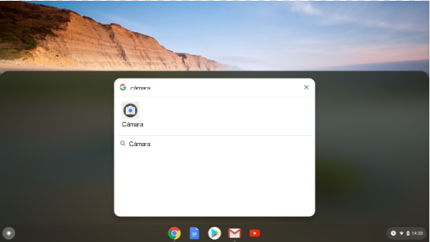
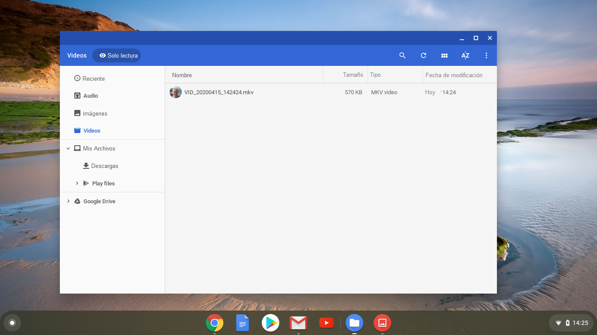
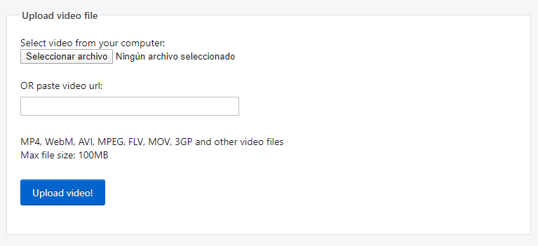
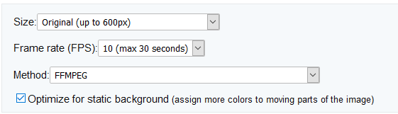
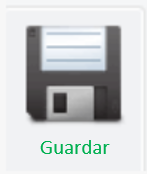

## Graba tu vídeo

No puedes añadir vídeo grabado a Scratch, pero puedes importar GIFs. Cuando importas un GIF como un objeto, Scratch divide el GIF y cada cuadro del GIF se convierte en un nuevo disfraz para el nuevo objeto.

**Recuerda que el vídeo que vas a crear será público, así que asegúrate de no tener nada que pueda identificar tu nombre o ubicación en la toma, y obtén el permiso de tus padres para crear y usar el vídeo primero.**

--- task ---

Mira las secciones contraídas a continuación para ayudarte a grabar unos segundos de vídeo usando la cámara web de tu ordenador, luego guarda el vídeo en tu disco.

--- /task ---

--- collapse ---
---

title: Grabación de vídeo con cámara web en Windows

---
- Haz clic en el menú** Inicio ** y elije la aplicación** Cámara **.

- Haz clic en el botón **Seleccionar Vídeo ** para grabar unos segundos de vídeo.

- Tu vídeo debe aparecer en tu carpeta` Imágenes \ Album de cámara`.

--- /collapse ---

--- collapse ---
---

title: Grabación de vídeo con cámara web en macOS

---
- Ve a tu menú ** Aplicaciones ** y abre QuickTime Player.

- Haz clic en ** Archivo ** > ** Nueva grabación de película **, luego permite el acceso a la cámara cuando se te solicite.

- Cuando hayas terminado, puedes guardar o exportar tu vídeo, y debería aparecer en tu escritorio.

--- /collapse ---

--- collapse ---
---

title: Grabación de vídeo con cámara web en Chrome OS

---

- Haz clic en el menú de aplicaciones y busca la aplicación** Cámara ** .

- Selecciona ** Vídeo ** en el lado derecho, y luego haga clic en el botón ** Grabar ** .

- Cuando hayas terminado, haga clic en el botón** Grabar ** nuevamente, y encontrarás tu archivo en la carpeta` Vídeos `.

--- /collapse ---

Ahora que tienes el vídeo, debes convertirlo a un GIF. Una manera fácil de hacer esto es usar [ el convertidor en rpf.io/gif ](https://rpf.io/gif) {: target = "_ blank"}.

--- task ---

Primero, sube tu vídeo: haz clic en el botón** Examinar **, haz clic en tu archivo, luego haz clic en el botón ** Cargar **.

--- /task ---

--- task ---

Para hacer las cosas un poco más rápido en Scratch, debes optimizar el GIF. Para hacer esto, selecciona la casilla** Optimizar **. También es posible que desees reducir la resolución.

--- /task ---

--- task ---

Click the **Convert** button, and when the GIF has been created, click on the **Save** icon to save your GIF.

 

--- /task ---

--- task ---

Cuando hayas terminado, verifica en tu carpeta de ` Descargas `el GIF.

--- /task ---

