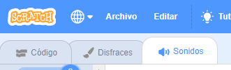
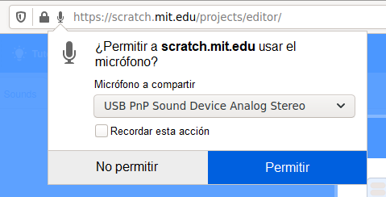
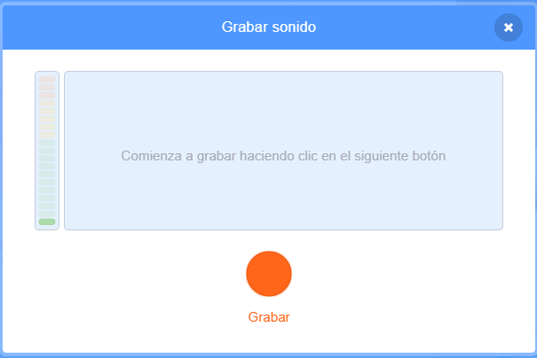

## Añade algo de sonido

--- task ---

Haz clic en la pestaña **Sonidos ** para tu objeto.



--- /task ---

--- task ---

En la esquina inferior izquierda de la pantalla, coloca el cursor sobre el botón** Elige un Sonido **y selecciona ** Grabar ** para grabar un nuevo sonido.


--- /task ---

--- task ---

Es posible que debas permitir que tu navegador web acceda a tu micrófono. Para hacer esto, haz clic en ** Permitir **.



--- /task ---

--- task ---

Haz clic en el botón **Grabar ** para comenzar a grabar tu voz. Cuando hayas terminado tu mensaje para el destinatario de tu tarjeta electrónica, haz clic en **Detener grabación**, luego haz clic en **Guardar**.



--- /task ---

--- task ---

Para reproducir el sonido, puedes usar un bloque `enviar`{: class = "block3control"} cuando comienza el ciclo de animación.

```blocks3
when flag clicked
switch costume to (ezgif v)
set size to (150) %
forever
+broadcast (message1 v)
repeat (35)
next costume
```

--- /task ---

--- task ---

Después, usa un bloque `al recibir`{:class="block3control"} para comenzar a reproducir el sonido.

```blocks3
when I receive (message1 v)
play sound (recording1 v) until done
```

--- /task ---

--- task ---

Es posible que desees utilizar un bloque `esperar`{:class="block3control"} para controlar cuándo comienza a reproducirse el sonido.

```blocks3
when I receive (message1 v)
+wait (0.4) seconds
play sound (recording1 v) until done
```

--- /task ---


