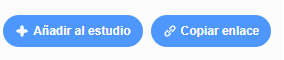

## Comparte tu tarjeta electrónica con amigos y familiares

Ahora que has creado tu tarjeta electrónica audiovisual, es hora de compartirla con tus amigos y familiares.

--- task ---

Asegúrate de haber iniciado sesión en Scratch, luego haz clic en el botón **Compartir**, para permitir que otros vean tu proyecto.

--- /task ---

--- task ---

Cuando hayas compartido tu proyecto, haz clic en el botón **Ver página del proyecto**. Esto puede llevar algo de tiempo, ya que el GIF debe cargarse.

--- /task ---

--- task ---

Ahora puedes copiar el enlace de tu proyecto y compartirlo por correo electrónico, una red social o una plataforma de mensajería.

--- /task ---

