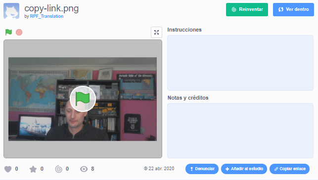

## Introducción

En este proyecto, utilizarás la plataforma Scratch para hacer una tarjeta electrónica audiovisual que puedes enviar a amigos y familiares.

### Lo que harás

--- no-print --- Haz clic en la bandera verde para ver la tarjeta electrónica. <iframe src="https://scratch.mit.edu/projects/419313682/embed" allowtransparency="true" width="485" height="402" frameborder="0" scrolling="no" allowfullscreen mark="crwd-mark"></iframe>

--- /no-print ---

--- solo imprimir ---  --- solo imprimir ---

--- collapse ---
---
title: Lo que necesitarás
---
### Equipo

- Un computador con cámara web y micrófono
- Una conexión a internet

### Programa

- Scratch 3 (ya sea [en línea](http://rpf.io/scratchon) o [sin conexión](http://rpf.io/scratchoff))
- Un navegador web

--- /collapse ---

--- collapse ---
---
title: Lo que vas a aprender
---

- Cómo convertir un video en GIF
- Cómo animar un GIF en Scratch
- Cómo agregar sonido grabado a una animación

--- /collapse ---

--- collapse ---
---
title: Información adicional para educadores
---

Si necesitas imprimir este proyecto, usa la [versión para imprimir](https://projects.raspberrypi.org/en/projects/av-e-card/print){:target="_blank"}.

--- /collapse ---
