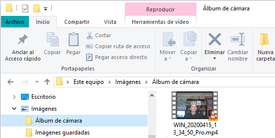
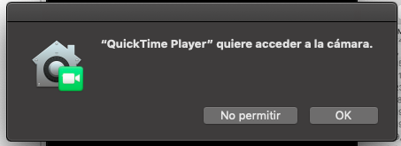
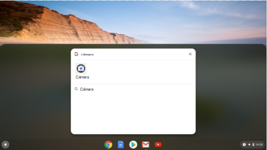
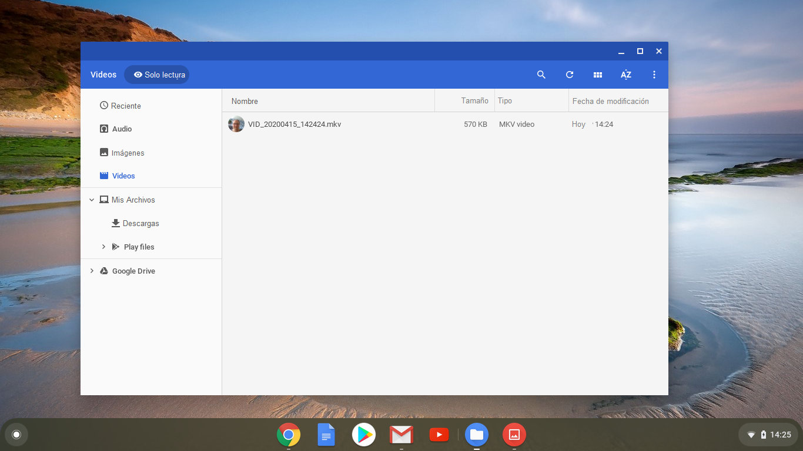
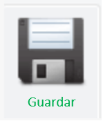

## Graba tu video

No puedes añadir vídeo grabado a Scratch, pero puedes importar GIFs. Cuando importas un GIF como un objeto, Scratch divide el GIF y cada cuadro del GIF se convierte en un nuevo disfraz para el nuevo objeto.

**Recuerda que el video que vas a crear será público, así que asegúrate de no tener nada que pueda identificar tu nombre o ubicación en la toma y primero obtén el permiso de tus padres para crear y usar el video.**

--- task ---

Revisa las secciones contraídas a continuación para ayudarte a grabar unos segundos de video usando la cámara web de tu computador, luego guarda el video en tu disco.

--- /task ---

--- collapse ---
---
title: Grabación de video con cámara web en Windows
---
- Haz clic en el menú **Inicio** y elije la aplicación **Cámara**.

- Haz clic en el botón **Grabar** para grabar unos segundos de video.

- Tu video debe aparecer en tu carpeta `Imágenes\Álbum de fotos`.

--- /collapse ---

--- collapse ---
---
title: Grabación de video con cámara web en macOS
---

- Ve a tu menú **Aplicaciones** y abre QuickTime Player.

- Haz clic en **Archivo** > **Nueva grabación de película**, luego permite el acceso a la cámara cuando se te solicite.

- Cuando hayas terminado, puedes guardar o exportar tu video y debería aparecer en tu escritorio.

--- /collapse ---

--- collapse ---
---
title: Grabación de vídeo con cámara web en Chrome OS
---

- Haz clic en el menú de aplicaciones y busca la aplicación **Cámara**.

- Selecciona **Video** en el lado derecho y luego haz clic en el botón **Grabar**.

- Cuando hayas terminado, haz clic en el botón **Grabar** nuevamente y encontrarás tu archivo en la carpeta `Videos`.

--- /collapse ---

Ahora que tienes el video, debes convertirlo a GIF. Una manera fácil de hacer esto es usar [el convertidor en rpf.io/gif](https://rpf.io/gif){:target="_blank"}.

--- task ---

Primero, sube tu video: haz clic en el botón **Examinar**, haz clic en tu archivo, luego haz clic en el botón **Cargar**.

--- /task ---

--- task ---

Para hacer las cosas un poco más rápido en Scratch, debes optimizar el GIF. Para hacer esto, selecciona la casilla **Optimizar**. También es posible que desees reducir la resolución.

--- /task ---

--- task ---

Haz clic en **Convertir** y, cuando se haya creado el GIF, haz clic en el icono **Guardar** para guardar tu GIF.

 

--- /task ---

--- task ---

Cuando hayas terminado, verifica que el GIF está en tu carpeta de `Descargas`.

--- /task ---

