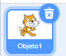
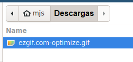
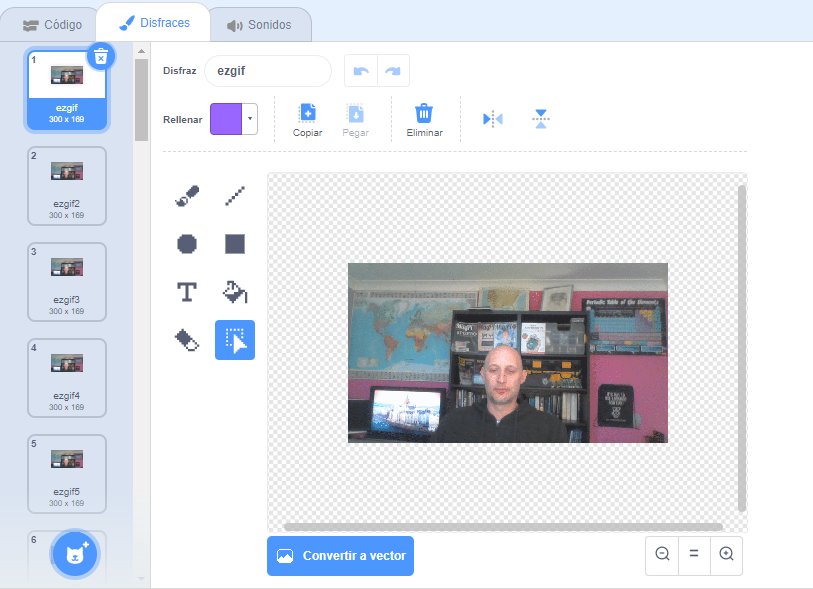

## Añade y crea un GIF animado en Scratch

--- task ---

Dirígete a [rpf.io/scratch-new](https://rpf.io/scratch-new) para abrir un nuevo proyecto de Scratch.

--- /task ---

--- task ---

Haz clic en el icono de la **Papelera** para eliminar el objeto Gato actual.



--- /task ---

--- task ---

Ahora, pasa el cursor sobre el botón **Elige un objeto**, luego haz clic en **Subir objeto** para cargar uno nuevo.


--- /task ---

--- task ---

Selecciona tu GIF desde el navegador de archivos, luego cárgalo.



--- /task ---

--- task ---

Haz clic en la pestaña **Disfraces** de tu nuevo objeto donde deberías ver todos los cuadros individuales de tu GIF.



Toma nota de la cantidad total de disfraces que tiene, ya que esto será importante en la próxima tarea.

--- /task ---

--- task ---

Para reproducir el GIF, puedes usar un bloque `repetir`{:class="block3control"}, dentro de un bloque `por siempre`{:class="block3control"}. El bloque `repetir`{:class="block3control"} debe coincidir con el número de fotogramas o cuadros del GIF importado.

```blocks3
when flag clicked
forever
repeat (35)
next costume
```
--- /task ---

--- task ---

Tu animación puede ser un poco rápida, así que agrega un bloque `esperar`{:class="block3control"} para ralentizarlo un poco.


```blocks3
when flag clicked
forever
repeat (35)
+wait (0.04) seconds
next costume
```

--- /task ---

--- task ---

También puedes aumentar el tamaño de la animación y reposicionarla en el centro del Escenario.

```blocks3
when flag clicked
+set size to (150) %
forever
repeat (35)
next costume
```

--- /task ---

--- task ---

También es útil asegurarse de que siempre comience a reproducir la animación desde el primer disfraz.

```blocks3
when flag clicked
+switch costume to (ezgif v)
set size to (150) %
forever
repeat (35)
next costume
```

--- /task ---


--- task ---

Haz clic en la bandera verde para ver la reproducción de tu video en el escenario.

--- /task ---


