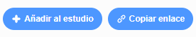

## Comparte tu tarjeta electrónica con amigos y familiares

Ahora que has creado tu tarjeta electrónica audiovisual, es hora de compartirla con tus amigos y familiares.

--- task ---

Asegúrate de haber iniciado sesión en Scratch, luego haz clic en el botón **Compartir**, para permitir que otros vean tu proyecto.

--- /task ---

--- task ---

Cuando hayas compartido tu proyecto, haz clic en el botón **Ver página del proyecto**. Esto puede tardar un momento, ya que el GIF debe cargarse.

--- /task ---

--- task ---

Ahora puedes copiar el enlace de tu proyecto y compartirlo por correo electrónico, una red social o una plataforma de mensajería.

--- /task ---

***
Este proyecto fue traducido por voluntarios:

Mariela Villalobos

Natalie Gomez Benavides

Gracias a los voluntarios, podemos dar a las personas de todo el mundo la oportunidad de aprender en su propio idioma. Puedes ayudarnos a llegar a más personas ofreciéndote como voluntario para traducir. Más información en [rpf.io/translate](https://rpf.io/translate).

