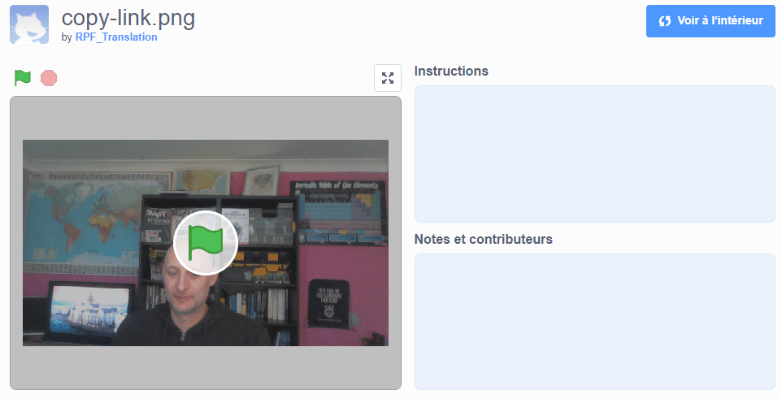

## Introduction

Dans ce projet, tu utiliseras la plateforme Scratch pour créer une carte virtuelle multimédia que tu pourras envoyer à tes amis et ta famille.

### Ce que tu feras

Clique sur le drapeau vert pour voir la carte virtuelle. <iframe src="https://scratch.mit.edu/projects/385557938/embed" allowtransparency="true" width="485" height="402" frameborder="0" scrolling="no" allowfullscreen mark="crwd-mark"></iframe>

--- /no-print ---

--- print-only ---  --- /print-only ---

--- collapse ---
---
title: Ce dont tu auras besoin
---
### Matériel informatique

- Un ordinateur avec une webcam et un microphone
- Une connexion internet

### Logiciel

- Scratch 3 (soit [en ligne](http://rpf.io/scratchon) ou [hors-ligne](http://rpf.io/scratchoff))
- Un navigateur web

--- /collapse ---

--- collapse ---
---
title: Ce que tu vas apprendre
---

- Comment convertir une vidéo en GIF
- Comment animer un GIF dans Scratch
- Comment ajouter du son enregistré à une animation

--- /collapse ---

--- collapse ---
---
title: Informations supplémentaires pour les éducateurs
---

Si vous avez besoin d'imprimer ce projet, merci d'utiliser la [version imprimable](https://projects.raspberrypi.org/en/projects/av-e-card/print){:target="_blank"}.

--- /collapse ---
