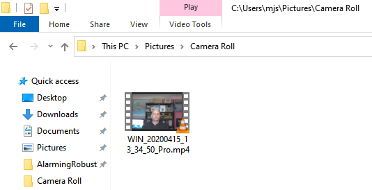

## Enregistre ta vidéo

Tu ne peux pas ajouter de vidéo enregistrée à Scratch, mais tu peux importer des GIFs. Lorsque tu importes un GIF en tant que sprite, Scratch sépare le GIF et chaque image du GIF devient un nouveau costume pour le nouveau sprite.

**N'oublie pas que la vidéo que tu vas créer sera publique, alors assure-toi que tu n'as rien qui puisse identifier ton nom ou ton emplacement dans la prise de vue, et obtiens d'abord la permission de tes parents pour créer et utiliser la vidéo.**

--- task ---

Regarde les sections réduites ci-dessous pour t'aider à enregistrer quelques secondes de vidéo à l'aide de la webcam de ton ordinateur, et ensuite enregistrer la vidéo sur ton disque dur.

--- /task ---

--- collapse ---
---

title: Enregistrement vidéo de la webcam sur Windows

---
- Clique sur le menu **Démarrer** et choisis l'application **Caméra**.

- Clique sur **Enregistrer** pour enregistrer quelques secondes de vidéo.

- Ta vidéo devrait apparaître dans ton dossier `Images\Pellicule`.

--- /collapse ---

--- collapse ---
---

title: Enregistrement vidéo de la webcam sur macOS

---
- Va dans **Applications** et ouvre QuickTime Player.

- Clique sur **Fichier** > **Nouvel enregistrement vidéo**, puis autorise l'accès à la caméra lorsque tu y es invité.

- Lorsque tu as terminé, tu peux enregistrer ou exporter ta vidéo et elle devrait apparaître sur ton bureau.

--- /collapse ---

--- collapse ---
---

title: Enregistrement vidéo de la webcam sur Chrome OS

---

- Clique sur le lanceur d'applications et recherche l'application **Caméra**.

- Sélectionne **Vidéo** sur le côté droit, puis clique sur le bouton **Enregistrer**.

- Lorsque tu as terminé, clique sur le bouton **Enregistrer** à nouveau, et tu trouveras ton fichier dans le dossier `Vidéos`.

--- /collapse ---

Maintenant que tu as la vidéo, tu dois la convertir en GIF. Un moyen simple de le faire est d'utiliser [le convertisseur sur rpf.io/gif](https://rpf.io/gif){:target="_ blank"}.

--- task ---

Tout d'abord, télécharge ta vidéo : clique sur **Parcourir** , clique sur ton fichier, puis sur le bouton **Télécharger**.

--- /task ---

--- task ---

Pour rendre les choses un peu plus rapides dans Scratch, tu dois optimiser le GIF. Pour ce faire, sélectionne la case à cocher **Optimiser**. Tu peux également vouloir réduire la résolution.

--- /task ---

--- task ---

Clique sur le bouton **Convertir en GIF** , et lorsque le GIF a été créé, clique sur l'icône **Enregistrer** pour enregistrer ton GIF.

 

--- /task ---

--- task ---

Lorsque tu as terminé, vérifie ton dossier `Téléchargements` pour le GIF.

--- /task ---

