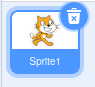
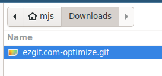
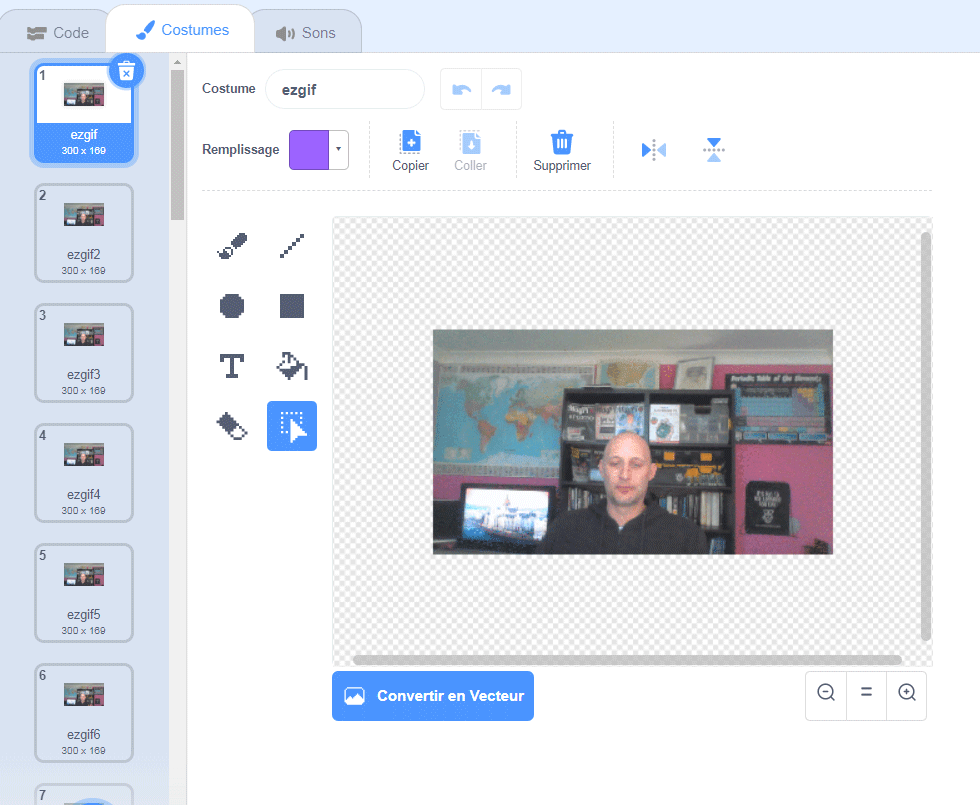

## Ajoute et anime ton GIF dans Scratch

--- task ---

Va sur [rpf.io/scratch-new](https://rpf.io/scratch-new) pour ouvrir un nouveau projet Scratch.

--- /task ---

--- task ---

Clique sur l'icône **Corbeille** pour supprimer le sprite de chat par défaut.



--- /task ---

--- task ---

Maintenant, survole le bouton **Choisir un sprite** puis clique sur **Importer un sprite** pour importer un nouveau sprite.


--- /task ---

--- task ---

Sélectionne ton GIF dans le navigateur de fichiers, puis importe-le.



--- /task ---

--- task ---

Clique sur les onglets **Costumes** pour ton nouveau sprite et tu devrais voir toutes les images individuelles de ton GIF.



Prends note du nombre total de costumes que tu as, car cela sera important dans la prochaine tâche.

--- /task ---

--- task ---

Pour lire le GIF, tu peux utiliser un bloc `répéter`{:class="block3control"}, à l'intérieur d'un bloc `répéter indéfiniment`{:class="block3control"}. Le bloc `répéter`{ class="block3control"} doit correspondre au nombre d'images provenant du GIF importé.

```blocks3
when flag clicked
forever
repeat (35)
next costume
```
--- /task ---

--- task ---

Si ton animation est trop rapide, ajoute un bloc `attendre`{:class="block3control"} pour la ralentir un peu.


```blocks3
when flag clicked
forever
repeat (35)
+wait (0.04) seconds
next costume
```

--- /task ---

--- task ---

Tu peux également augmenter la taille de l'animation et la repositionner au centre de la scène.

```blocks3
when flag clicked
+set size to (150) %
forever
repeat (35)
next costume
```

--- /task ---

--- task ---

Il est également utile de toujours commencer à jouer l'animation depuis le premier costume.

```blocks3
when flag clicked
+switch costume to (ezgif v)
set size to (150) %
forever
repeat (35)
next costume
```

--- /task ---


--- task ---

Clique sur le drapeau vert pour lancer et voir ta vidéo sur la scène.

--- /task ---


