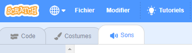
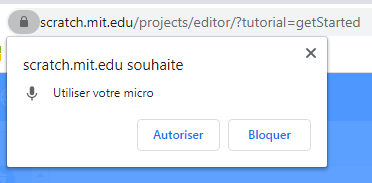
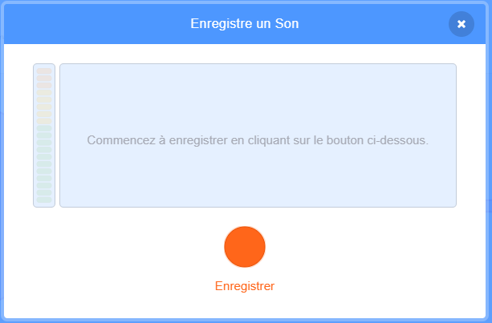

## Ajoute du son

--- task ---

Clique sur l'onglet **Sons** de ton sprite.



--- /task ---

--- task ---

Dans le coin inférieur gauche de l'écran, passe la souris sur **Choisir un son** et sélectionne **Enregistrer** pour enregistrer un nouveau son.


--- /task ---

--- task ---

Tu devras peut-être autoriser ton navigateur Web à accéder à ton microphone. Pour ce faire, clique sur **Autoriser**.



--- /task ---

--- task ---

Clique sur **Enregistrer** pour enregistrer quelques secondes de ta voix. Lorsque tu as terminé ton message pour le destinataire de ta carte virtuelle, clique sur **Arrêter l'enregistrement**, puis clique sur **Enregistrer**.



--- /task ---

--- task ---

Pour lire le son, tu peux utiliser un bloc `envoyer à tous`{:class="block3control"} quand la boucle d'animation démarre.

```blocks3
when flag clicked
switch costume to (ezgif v)
set size to (150) %
forever
+broadcast (message1 v)
repeat (35)
+wait (0.04) seconds
next costume
```

--- /task ---

--- task ---

Ensuite, utilise un bloc `quand je reçois`{:class="block3control"} pour commencer la lecture du son.

```blocks3
when I receive (message1 v)
play sound (recording1 v) until done
```

--- /task ---

--- task ---

Tu peux aussi utiliser un bloc `attendre`{:class="block3control"} pour contrôler le début de la lecture du son.

```blocks3
when I receive (message1 v)
+wait (0.4) seconds
play sound (recording1 v) until done
```

--- /task ---


