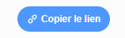

## Share your e-card with friends and family

Now that you've created your audiovisual e-card, it's time to share it with your friends and family.

--- task ---

Make sure that you are logged in to Scratch, then click the **Share** button, to allow others to view your project.

--- /task ---

--- task ---

When your project has been shared, click the **See Project Page** button. This might take some time, as the GIF needs to be uploaded.

--- /task ---

--- task ---

You can now copy the link for your project and share it via email, a social network, or a messaging platform.

--- /task ---

