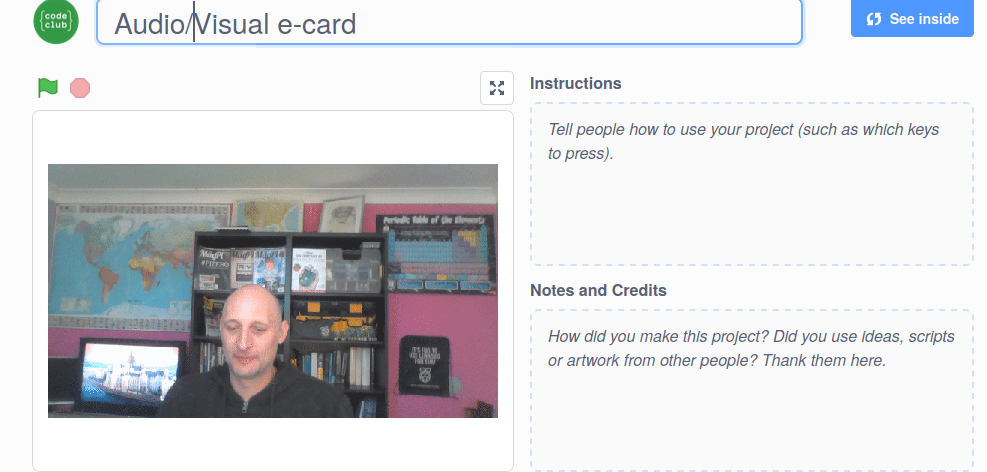

## परिचय

इस प्रोजेक्ट में, आप Scratch प्लेटफॉर्म का उपयोग करके एक अनोखा ई-कार्ड बनाएंगे जिसे आप आपके मित्रों और परिवार को भेज सकते हैं।

### आप क्या बनाएँगे

--- no-print --- ई-कार्ड देखने के लिए हरे झंडे पर क्लिक करें। <iframe src="https://scratch.mit.edu/projects/419313682/embed" allowtransparency="true" width="485" height="402" frameborder="0" scrolling="no" allowfullscreen></iframe>

--- /no-print ---

--- print-only ---  --- /print-only ---

--- collapse ---
---
title: आपको किन चीजों की आवश्यकता होगी
---
### हार्डवेयर

- एक कंप्यूटर जिसमें वेब कैमरा और माइक्रोफोन हों
- एक इंटरनेट कनेक्शन (internet connection)

### सॉफ्टवेयर

- Scratch 3 ([ऑनलाइन](http://rpf.io/scratchon) या [ऑफ़लाइन](http://rpf.io/scratchoff))
- एक वेब ब्राउज़र (web browser)

--- /collapse ---

--- collapse ---
---
title: आप क्या सीखेंगे
---

- वीडियो को GIF में कैसे परिवर्तित(convert) करें
- Scratch में GIF को कैसे एनिमेट करें
- एनीमेशन में रिकॉर्डेड साउंड को कैसे जोड़ा जाए

--- /collapse ---

--- collapse ---
---
title: शिक्षकों के लिए अतिरिक्त जानकारी
---

अगर आपको इस प्रोजेक्ट को प्रिंट करने की आवश्यकता है, तो कृपया [प्रिंटर-अनुकूल संस्करण](https://projects.raspberrypi.org/en/projects/av-e-card/print){:target="_blank"} का उपयोग करें।

--- /collapse ---
