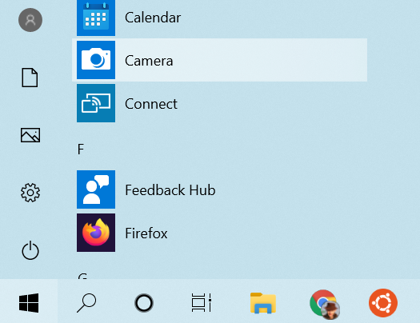
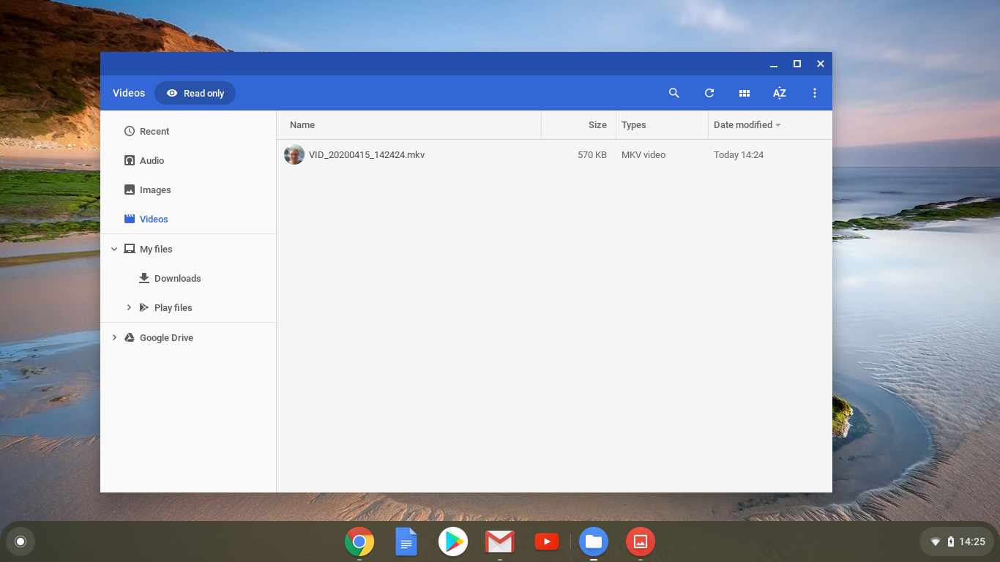

## अपना वीडियो रिकॉर्ड करें

आप रिकॉर्ड किया गया वीडियो Scratch में नहीं जोड़ सकते, लेकिन आप GIF को जोड़ सकते हैं। जब आप GIF को sprite के रूप में जोड़ते हैं, तो Scratch GIF को तोड़ देता है, और GIF के प्रत्येक फ्रेम नए स्प्राइट के लिए एक नई पोशाक बन जाती है।

**याद रखें कि आप जो वीडियो बनाने जा रहे हैं वह सार्वजनिक होगा, इसलिए सुनिश्चित करें कि आपके वीडियो में ऐसा कुछ भी नहीं हों जिसमें आपके नाम या स्थान की पहचान हो सके, और पहले वीडियो बनाने और उसका उपयोग करने के लिए अपने माता-पिता से अनुमति प्राप्त करें।**

--- task ---

अपने कंप्यूटर के वेबकैम का उपयोग करके कुछ सेकंड के वीडियो को रिकॉर्ड करने में मदद करने के लिए नीचे दिए गए संक्षिप्त किए गए अनुभाग देखें, फिर वीडियो को अपनी ड्राइव (drive) पर सहेजें (save)।

--- /task ---

--- collapse ---
---

title: Windows पर वेब कैमरा से वीडियो रिकॉर्डिंग करना

---
- **Start** मेन्यू पर क्लिक करें और **Camera** एप्लिकेशन (application) को चुनें।

- **Record** बटन पर क्लिक करें और कुछ सेकंड का वीडियो रिकॉर्ड करें।

- आपका वीडियो आपके `Pictures\Camera Roll` फ़ोल्डर में दिखाई देना चाहिए।

--- /collapse ---

--- collapse ---
---

title: macOS पर वेबकैम वीडियो रिकॉर्डिंग करना

---
- अपने **Applications** मेन्यू में जाएं और QuickTime Player को खोलें।

- **File** > **New Movie Recording** को चुनें, तब जब पूछा जाए तो कैमरा इस्तमाल करने की अनुमति दीजिए।

- जब आप समाप्त कर लें, तो आप अपने वीडियो को सहेज (save) या निर्यात (export) कर सकते हैं, और यह आपके डेस्कटॉप (desktop) पर दिखाई देना चाहिए।

--- /collapse ---

--- collapse ---
---

title: Chrome OS पर वेब कैमरा वीडियो रिकॉर्डिंग करना

---

- अपने एप्लिकेशन लॉन्चर पर क्लिक करें और **Camera** एप्लिकेशन खोजें।

- दाईं ओर में **Video** को चुनें, और फिर **Record** बटन पर क्लिक करें।

- जब आप समाप्त कर लें, तो **Record** बटन पर फिर क्लिक करें, और आपको अपनी फ़ाइल `Videos` फ़ोल्डर में मिलेगी।

--- /collapse ---

अब जब आपके पास वीडियो है, तो आपको इसे GIF में बदलना होगा। ऐसा करने का एक आसान तरीका है: [rpf.io/gif के कन्वर्टर का प्रयोग करें](https://rpf.io/gif){:target="_blank"}

--- task ---

First, upload your video: click the **Browse** button, click on your file, then click the **Upload video** button.

--- /task ---

--- task ---

Scratch में चीजों को थोड़ा तेज करने के लिए, आपको GIF का अनुकूलन(optimise) करना चाहिए। ऐसा करने के लिए, **Optimize** चेकबॉक्स को चुनें। अगर आप चाहे तो आप रेसोलुशन (resolution) को कम भी कर सकते हैं।

--- /task ---

--- task ---

Click the **Convert to GIF** button, and when the GIF has been created, click on the **Save** icon to save your GIF.

 

--- /task ---

--- task ---

जब आप समाप्त कर लें, तो अपने `Downloads` फ़ोल्डर में GIF को ढूंढे।

--- /task ---

