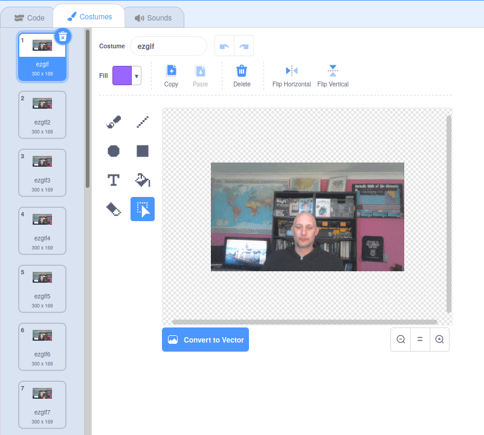

## अपने GIF को Scratch में जोड़ें और एनिमेट (animate) करें

--- task ---

[rpf.io/scratch-new](https://rpf.io/scratch-new) पर जाके नया Scratch प्रोजेक्ट खोलें।

--- /task ---

--- task ---

Scratch के बिल्ली sprite को हटाने के लिए **bin** आइकन पर क्लिक करें।


--- /task ---

--- task ---

अब **Choose a Sprite** पर जाएं और नए sprite को जोड़ने के लिए **Upload Sprite** पर क्लिक करें।


--- /task ---

--- task ---

फ़ाइल ब्राउज़र से अपना GIF चुनें, फिर उसे अपलोड करें।


--- /task ---

--- task ---

नए sprite को जोड़ने के लिए **Costumes** टैब पर क्लिक करें और आपको अपने GIF से सभी फ़्रेम दिखाई देंगे।



आपके पास जितने भी costume है, उसकी कुल संख्या पर ध्यान दें, क्योंकि यह अगले कार्य में महत्वपूर्ण होगा।

--- /task ---

--- task ---

GIF को प्ले करने के लिए, आप एक `forever`{:class="block3control"} ब्लॉक के अंदर `repeat`{:class="block3control"} ब्लॉक का उपयोग कर सकते हैं। `repeat`{:class="block3control"} ब्लॉक को जोड़े गए GIF की फ्रेम की संख्या से मेल खाना चाहिए।

```blocks3
when flag clicked
forever
repeat (35)
next costume
```
--- /task ---

--- task ---

आपका एनीमेशन थोड़ा तेज़ हो सकता है, इसलिए एक `wait`{:class="block3control"} ब्लॉक का प्रयोग करके इसे थोड़ा धीमा कर सकते हैं।


```blocks3
when flag clicked
forever
repeat (35)
+wait (0.04) seconds
next costume
```

--- /task ---

--- task ---

आप एनीमेशन के आकार को बढ़ाना भी पसंद कर सकते हैं और इसे स्टेज के केंद्र में रख सकते हैं।

```blocks3
when flag clicked
+set size to (150) %
forever
repeat (35)
next costume
```

--- /task ---

--- task ---

यह सुनिश्चित करना भी अच्छा रहेगा कि आप हमेशा पहले costume से ही एनीमेशन चलाना शुरू करते हैं।

```blocks3
when flag clicked
+switch costume to (ezgif v)
set size to (150) %
forever
repeat (35)
next costume
```

--- /task ---


--- task ---

स्टेज पर अपने वीडियो को चलते देखने के लिए हरे झंडे पर क्लिक करें।

--- /task ---


