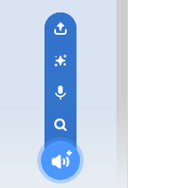
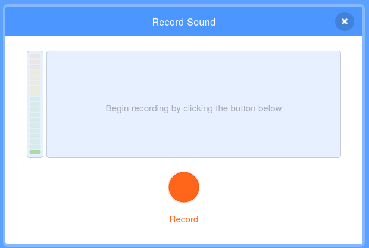

## कुछ आवाज जोड़ें

--- task ---

अपने sprite के **Sounds** टैब पर क्लिक करें।


--- /task ---

--- task ---

स्क्रीन के निचले बाएँ कोने में **Choose a Sound** बटन पर जाएं और एक नई ध्वनि रिकॉर्ड करने के लिए **Record** पर क्लिक करें।



--- /task ---

--- task ---

आपको अपने वेब ब्राउज़र को अपने माइक्रोफ़ोन तक पहुंचने की अनुमति देनी पड़ सकती है। ऐसा करने के लिए, **Allow** पर क्लिक करें।


--- /task ---

--- task ---

**Record** बटन पर क्लिक करें और अपना आवाज़ रेकॉर्ड कीजिए। जब आपने अपने ई-कार्ड के प्राप्तकर्ता (recipient) के लिए अपना संदेश पूरा कर लिया है, तो **Stop recording** पर क्लिक करें, फिर **Save** पर क्लिक करें।



--- /task ---

--- task ---

ध्वनि चलाने के लिए, आप `broadcast`{:class="block3control"} ब्लॉक का उपयोग कर सकते हैं जब एनिमेशन लूप शुरू होता है।

```blocks3
when flag clicked
switch costume to (ezgif v)
set size to (150) %
forever
+broadcast (message1 v)
repeat (35)
+wait (0.04) seconds
next costume
```

--- /task ---

--- task ---

फिर, `when I receive`{:class="block3control"} ब्लॉक का उपयोग ध्वनि को शुरू करने के लिए प्रयोग करें।

```blocks3
when I receive (message1 v)
play sound (recording1 v) until done
```

--- /task ---

--- task ---

आप ध्वनि को नियंत्रित करने के लिए `wait`{:class="block3control"} ब्लॉक का उपयोग कर सकते हैं।

```blocks3
when I receive (message1 v)
+wait (0.4) seconds
play sound (recording1 v) until done
```

--- /task ---


