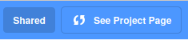
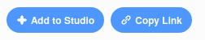

## अपने ई-कार्ड को दोस्तों और परिवार के साथ शेयर (share) करें

अब जब आपने अपना अनोखा ई-कार्ड बना लिया है तो इसे अपने दोस्तों और परिवार के साथ शेयर करने का समय आ गया है।

--- task ---

सुनिश्चित करें कि आप Scratch में लॉग इन (logged in) हैं, दूसरों को आपका प्रोजेक्ट को देखने की अनुमति देने के लिए **Share** बटन पर क्लिक करें।

--- /task ---

--- task ---

जब आपका प्रोजेक्ट शेयर हो गया हो, तो **See Project Page** बटन पर क्लिक करें। इसे कुछ समय लग सकता है, क्योंकि GIF को अपलोड करना होगा।

--- /task ---

--- task ---

अब आप अपने प्रोजेक्ट के लिंक को कॉपी (copy) कर सकते हैं और इसे ई-मेल (e-mail), सोशल नेटवर्क (social network) या मैसेजिंग प्लेटफॉर्म (messaging platform) के माध्यम से शेयर कर सकते हैं।

--- /task ---

***
समुदाय के योगदान से किया गया अनुवाद

इस परियोजना का अनुवाद आदित्य बोरकर ने किया है और समीक्षा वसुंधरा द्वारा कि गयी  है।

हमारे अद्भुत अनुवाद स्वयंसेवक हमारी मदद करते है ताकि हम दुनिया भर के बच्चों को कोड करना सीखने का मौका प्रदान कर सके।. आप हमारी परियोजनाओं का अनुवाद करके और अधिक बच्चों तक पहुंचने में हमारी सहायता कर सकते हैं - [rpf.io/translate](https://rpf.io/translate) पर जाकर अधिक जानकारी हासिल करे

