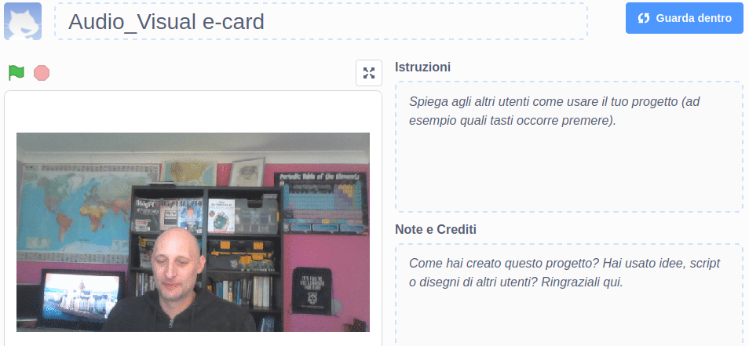

## Introduzione

In questo progetto, utilizzerai la piattaforma Scratch per creare un biglietto di auguri multimediale che puoi inviare ad amici e parenti.

### Che cosa creerai

--- no-print --- Clicca sulla bandiera verde per vedere il biglietto d'auguri. 

<iframe src="https://scratch.mit.edu/projects/385557938/embed" allowtransparency="true" width="485" height="402" frameborder="0" scrolling="no" allowfullscreen mark="crwd-mark"></iframe>

--- /no-print ---

--- print-only ---  --- /print-only ---

--- collapse ---
---
title: Di cosa avrai bisogno
---
### Hardware

- Un computer con webcam e microfono
- Una connessione internet

### Software

- Scratch 3 ([online](http://rpf.io/scratchon) o [offline](http://rpf.io/scratchoff))
- Un browser web

--- /collapse ---

--- collapse ---
---
title: Cosa imparerai
---

- Come convertire un video in una GIF
- Come animare una GIF in Scratch
- Come aggiungere l'audio registrato a un'animazione

--- /collapse ---

--- collapse ---
---
title: Informazioni aggiuntive per gli educatori
---

Se intendete stampare questo progetto, cliccate su [Versione stampabile](https://projects.raspberrypi.org/it-IT/projects/av-e-card/print){:target="_blank"}.

--- /collapse ---
