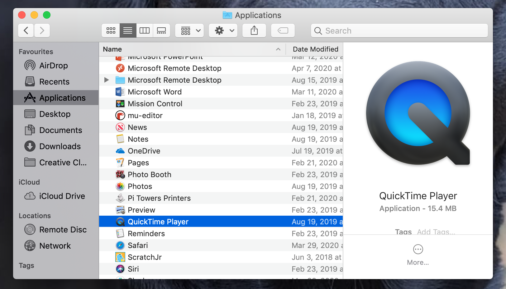

## Registra il tuo video

Non puoi aggiungere video registrati a Scratch, ma puoi importare delle GIF. Quando importi una GIF come sprite, Scratch divide la GIF in fotogrammi e ogni fotogramma della GIF diventa un nuovo costume per il nuovo sprite.

**Ricorda che il video che creerai sarà pubblico, quindi assicurati di non riprendere nulla che possa identificare il tuo nome o la tua posizione e ottieni prima l'autorizzazione dai tuoi genitori per creare e utilizzare il video.**

--- task ---

Guarda le sezioni seguenti per aiutarti a registrare alcuni secondi di video utilizzando la webcam del tuo computer, quindi salva il video sul tuo disco.

--- /task ---

--- collapse ---
---
title: Registrare video con la webcam su Windows
---
- Fai clic sul menu **Start** e seleziona **Fotocamera** dall'elenco delle app.

- Fai clic sul pulsante **Acquisici video** per registrare alcuni secondi di video.

- Il tuo video dovrebbe apparire nella cartella `Immagini\Rullino`.

--- /collapse ---

--- collapse ---
---
title: Registrare video con la webcam su macOS
---
- Vai sul menu **Applicazioni** e apri QuickTime Player.

- Fai clic su **File** > **Nuova registrazione filmato**, quindi consenti l'accesso alla videocamera quando richiesto.

- Al termine è possibile salvare o esportare il video, che dovrebbe apparire sul desktop.

--- /collapse ---

--- collapse ---
---
title: Registrare video con la webcam su Chrome OS
---

- Fai clic sul tasto Avvio app nell'angolo dello schermo e cerca la app **Fotocamera**.

- Seleziona **Video** sul lato destro, quindi fai clic su **Avvia registrazione**.

- Al termine, fai clic nuovamente sul pulsante **Registra** e troverai il tuo file nella cartella `Video`.

--- /collapse ---

Ora che hai il video, devi convertirlo in GIF. Un modo semplice per farlo è usare [il convertitore su rpf.io/gif](https://rpf.io/gif) {:target="_ blank"}.

--- task ---

Innanzitutto carica il video: fai clic su **Browse**, seleziona il tuo file, e quindi fai clic su **Upload**.

--- /task ---

--- task ---

Per rendere le cose un po' più veloci in Scratch, dovresti ottimizzare la GIF. Per fare ciò, spunta la casella **Optimize**. Potresti anche voler ridurre la risoluzione.

--- /task ---

--- task ---

Fai clic su **Convert** e, una volta creata la GIF, fai clic sull'icona **Save** per salvare la tua GIF.

 

--- /task ---

--- task ---

Al termine, cerca la tua GIF nella cartella `Download`.

--- /task ---

