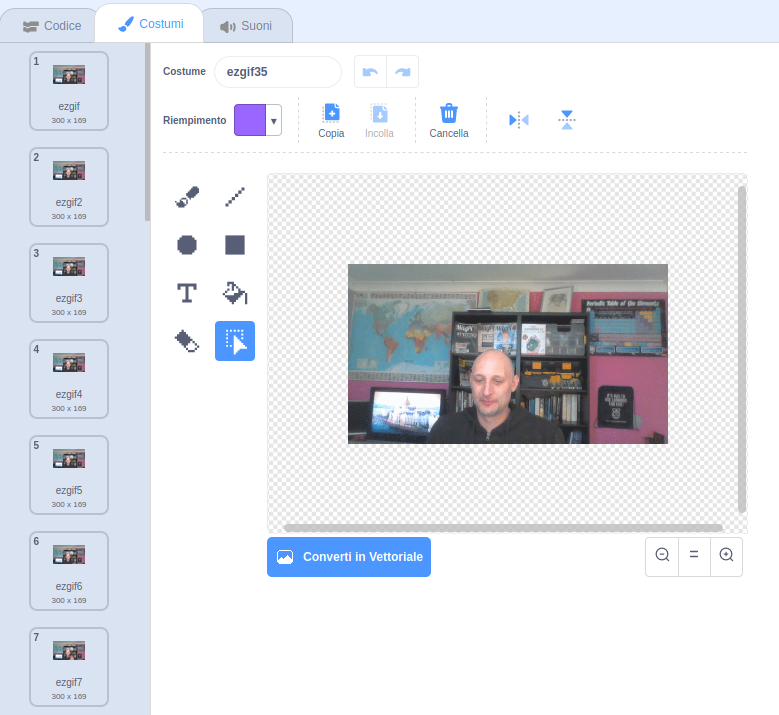

## Aggiungi e anima la tua GIF in Scratch

--- task ---

Apri [rpf.io/scratch-new](https://rpf.io/scratch-new) per aprire un nuovo progetto Scratch.

--- /task ---

--- task ---

Fai clic sull'icona **Cestino** per eliminare lo sprite predefinito di Scratch.


--- /task ---

--- task ---

Ora passa con il mouse sopra al pulsante **Scegli uno Sprite**, e quindi fai clic su **Importa Sprite** per caricare un nuovo sprite.


--- /task ---

--- task ---

Seleziona la tua GIF dal browser dei file, quindi caricala.


--- /task ---

--- task ---

Fai clic sulla scheda **Costumi** del tuo nuovo sprite e dovresti vedere tutti i singoli fotogrammi dalla tua GIF.



Prendi nota del numero totale di costumi che hai, poiché questo sarà importante nella prossima attività.

--- /task ---

--- task ---

Per riprodurre la GIF in sequenza, puoi usare un blocco `ripeti`{:class="block3control"} all'interno di un blocco `per sempre`{:class="block3control"}. Il numero di ripetizioni del blocco `ripeti`{:class="block3control"} deve corrispondere al numero di fotogrammi (frame) dalla GIF importata.

```blocks3
when flag clicked
forever
repeat (35)
next costume
```
--- /task ---

--- task ---

La tua animazione potrebbe essere un po' troppo veloce, quindi aggiungi un blocco `attendi`{:class="block3control"} per rallentarla un po'.


```blocks3
when flag clicked
forever
repeat (35)
+wait (0.04) seconds
next costume
```

--- /task ---

--- task ---

Potresti anche voler aumentare la dimensione dell'animazione e riposizionarla al centro dello Stage.

```blocks3
when flag clicked
+set size to (150) %
forever
repeat (35)
+wait (0.04) seconds
next costume
```

--- /task ---

--- task ---

È anche utile assicurarsi di iniziare sempre a riprodurre l'animazione dal primo costume.

```blocks3
when flag clicked
+switch costume to (ezgif v)
set size to (150) %
forever
repeat (35)
+wait (0.04) seconds
next costume
```

--- /task ---


--- task ---

Fai clic sulla bandiera verde per guardare il tuo video riprodotto sullo Stage.

--- /task ---


