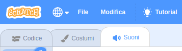
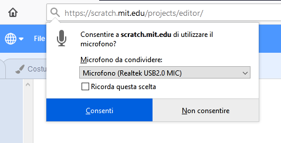
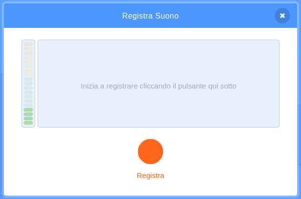

## Aggiungi il sonoro

--- task ---

Fai clic sulla scheda **Suoni** del tuo sprite.



--- /task ---

--- task ---

Nell'angolo in basso a sinistra dello schermo, passa con il mouse sopra al pulsante **Scegli un suono** e seleziona **Registra** per registrare un nuovo suono.


--- /task ---

--- task ---

Potrebbe essere necessario consentire al browser Web di accedere al microfono. Per fare ciò, fai clic su **Consenti**.



--- /task ---

--- task ---

Fai clic sul pulsante **Registra** per iniziare a registrare la tua voce. Al termine del messaggio, fai clic su **Arresta la registrazione**, quindi fai clic su **Salva**.



--- /task ---

--- task ---

Per riprodurre il suono è possibile utilizzare un blocco `Invia a tutti`{:class="block3control"} all'avvio del ciclo di animazione.

```blocks3
when flag clicked
switch costume to (ezgif v)
set size to (150) %
forever
+broadcast (message1 v)
repeat (35)
next costume
```

--- /task ---

--- task ---

Quindi, utilizzare un blocco `quando ricevo`{:class="block3control"} per avviare la riproduzione del suono.

```blocks3
when I receive (message1 v)
play sound (recording1 v) until done
```

--- /task ---

--- task ---

Potresti usare un blocco `attendi`{:class="block3control"} per controllare quando inizia la riproduzione del suono.

```blocks3
when I receive (message1 v)
+wait (0.4) seconds
play sound (recording1 v) until done
```

--- /task ---


