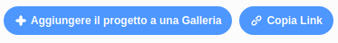

## Condividi il tuo biglietto d'auguri con amici e familiari

Ora che hai creato il tuo biglietto d'auguri, è tempo di condividerlo con amici e familiari.

--- task ---

Assicurati di aver effettuato l'accesso a Scratch, quindi fai clic su **Condividi** per consentire agli altri di visualizzare il tuo progetto.

--- /task ---

--- task ---

Quando il progetto è stato condiviso, fai clic sul pulsante **Vai alla pagina del progetto **. Questo potrebbe richiedere del tempo, poiché è necessario caricare la GIF.

--- /task ---

--- task ---

Ora puoi copiare il link per il tuo progetto e condividerlo tramite e-mail, social network o una piattaforma di messaggistica.

--- /task ---

***

Questo progetto è stato tradotto da volontari:

Alessio Spadaro
Fabrizio Sala

Grazie ai volontari, possiamo offrire alle persone di tutto il mondo la possibilità di imparare nella loro lingua. Puoi aiutarci a raggiungere più persone offrendoti come volontario per la traduzione - puoi trovare maggiori informazioni su [rpf.io/translate](https://rpf.io/translate).

