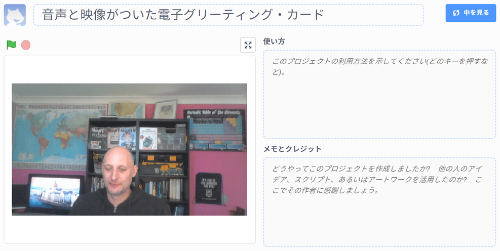

## はじめに

このプロジェクトでは、Scratchプラットフォームをつかって友だちや家族に送る音声と映像がついた電子グリーティング・カードをつくります。

### 作るもの

--- no-print --- 電子グリーティング・カードを見るには緑色の旗を押します。 
<iframe src="https://scratch.mit.edu/projects/385557938/embed" allowtransparency="true" width="485" height="402" frameborder="0" scrolling="no" allowfullscreen mark="crwd-mark"></iframe>

--- /no-print ---

--- print-only ---  --- /print-only ---

--- collapse ---
---
title: 必要 (ひつよう) なもの
---
### ハードウェア

- ウェブカメラとマイクがついているコンピューター
- インターネットにつながる環境（かんきょう）

### ソフトウェア

- Scratch 3 ([オンライン](http://rpf.io/scratchon)または[オフライン](http://rpf.io/scratchoff))
- ウェブブラウザ

--- /collapse ---

--- collapse ---
---
title: 学ぶこと
---

- 動画をGIFに変換（へんかん）する方法
- ScratchでGIFをアニメーションにする方法
- アニメーションに録音した音声をいれる方法

--- /collapse ---

--- collapse ---
---
title: 指導者向けの追加情報
---

このプロジェクトを印刷する必要がある場合は、 [印刷用バージョン](https://projects.raspberrypi.org/ja-JP/projects/av-e-card/print){:target="_blank"}を使用してください。

--- /collapse ---
