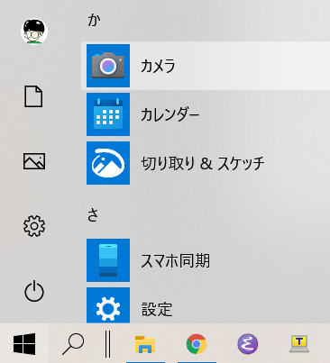
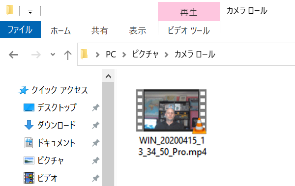
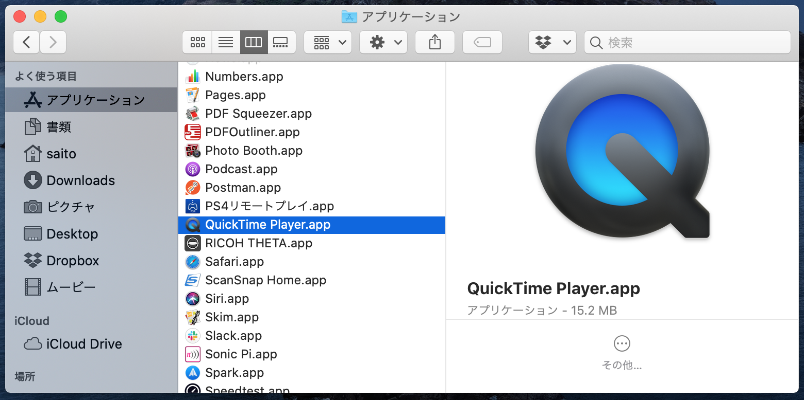
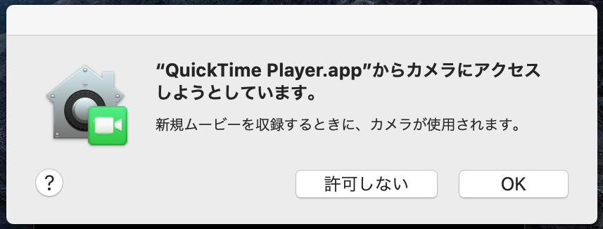
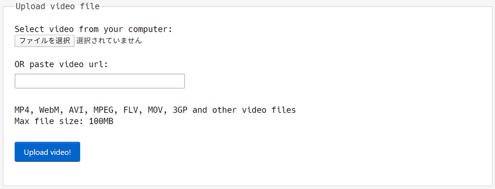

## 動画を録画する

Scratchに録画した動画をいれることはできませんが、GIFを取り込むことはできます。 GIFをスプライトとして取り込むと、ScratchがそのGIFを分割し、GIFの各フレームが新しいスプライトに対する新しいコスチュームになります。

**作成しようとしている動画は公開されることに注意してください。あなたの名前や映っている場所が特定できるものがないことを確認し、まずはお父さん・お母さんに動画を作って使っていいか許可を得てください。**

--- task ---

下の折りたたまれた部分を見て、コンピューターのウェブカメラを使って数秒の動画を録画し、コンピューターに保存します。

--- /task ---

--- collapse ---
---

title: Windowsでウェブカメラを使って動画を録画する

---
- **スタート**メニューをクリックして**カメラ**アプリを選びます。

- **ビデオの撮影**ボタンを押して数秒の動画を撮影しましょう。

- 動画は`ピクチャ\カメラ ロール`フォルダーに保存されます。

--- /collapse ---

--- collapse ---
---

title: macOSでウェブカメラを使って動画を録画する

---
- **アプリケーション**メニューからQuickTime Playerを開きます。

- **ファイル** > **新規ムービー収録**を押します。カメラへのアクセスを求めるダイアログが表示された場合は許可してください。

- 録画が完了したら、動画を保存もしくは書き出すことができます。その動画はデスクトップに置かれます。

--- /collapse ---

--- collapse ---
---

title: Chrome OSでウェブカメラを使って動画を録画する

---

- アプリケーションラウンチャーを押し、**カメラ**アプリを検索します。

- 右側にある**ビデオ**を選び、**録画を開始**ボタンを押します。

- 録画が完了したら、もう一度**録画を開始**ボタンを押します。`ビデオ`フォルダにファイルが置かれます。

爆発

動画を作成したので、今度はGIFに変換する必要があります。 変換するには[rpf.io/gifにある変換サービス](https://rpf.io/gif){:target="_blank"}を使うのが一番かんたんです。

--- task ---

まず，動画をアップロードします：**ファイルを選択**ボタンを押し、ファイルを選んで**Upload video!**（動画をアップロード！）ボタンを押します。

--- /task ---

--- task ---

Scratchでの処理をちょっと速くするために、GIFを最適化（さいてきか）する必要があります。 最適化（さいてきか）するには、**Optimize**（最適化（さいてきか）する）チェックボックスにチェックをつけます。 画像の解像度（かいぞうど）を下げるのもよいかもしれません。

--- /task ---

--- task ---

**Convert to GIF!**（GIFに変換する！）ボタンを押します。GIFが生成されたら、**Save**アイコンを押してGIFを保存します。

 

--- /task ---

--- task ---

完了したら、`ダウンロード`フォルダーにGIFがあるか確認します。

--- /task ---

