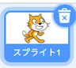
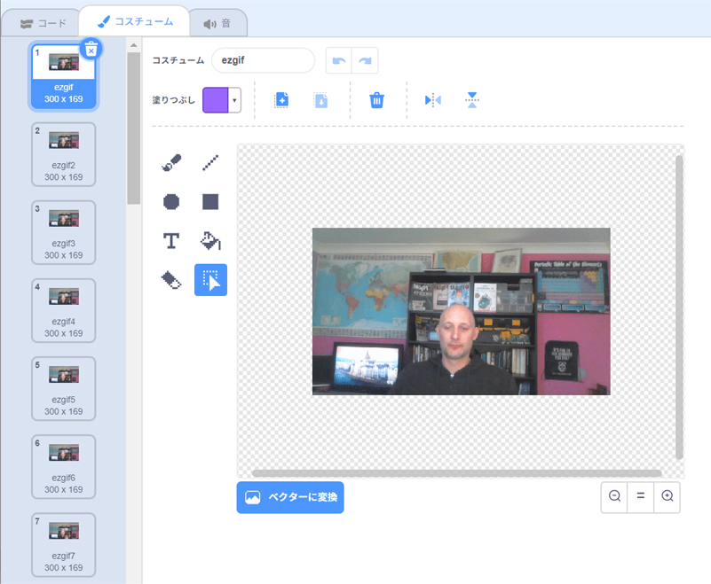

## ScratchでGIFをアニメーションにする方法

--- task ---

[rpf.io/scratch-new](https://rpf.io/scratch-new)にアクセスして新しいScratchプロジェクトを開きます。

--- /task ---

--- task ---

**ゴミ箱**アイコンを押して、もともとあるScratchのネコのスプライトを消します。



--- /task ---

--- task ---

次に、**スプライトを選ぶ**ボタンにマウスカーソルを合わせて、**スプライトをアップロード**を押して、新しいスプライトをアップロードします。


--- /task ---

--- task ---

ファイルブラウザからGIFを選んでアップロードします。


--- /task ---

--- task ---

新しいスプライトで**コスチューム**タグを押すと、GIFから生成されたすべてのフレームが見られるようになります。



次の作業で必要になるので、コスチュームが全部でいくつあるかメモしておきましょう。

--- /task ---

--- task ---

GIFをすべて再生するには、`ずっと`{:class="block3control"}ブロックの中に`繰り返す`{:class="block3control"}ブロックを入れて使います。 `繰り返す`{:class="block3control"}ブロックに指定する数は、読み込んだGIFのフレーム数と同じする必要があります。

```blocks3
when flag clicked
forever
repeat (35)
next costume
```
--- /task ---

--- task ---

アニメーションが少し速いかもしれないので、少し遅くするために`待つ`{:class="block3control"}ブロックを入れます。


```blocks3
when flag clicked
forever
repeat (35)
+wait (0.04) seconds
next costume
```

--- /task ---

--- task ---

アニメーションの大きさを大きくして、ステージの真ん中に置きなおすこともできます。

```blocks3
when flag clicked
+set size to (150) %
forever
repeat (35)
+wait (0.04) seconds
next costume
```

--- /task ---

--- task ---

アニメーションの再生が、いつも最初のコスチュームからはじまるようになると助かります。

```blocks3
when flag clicked
+switch costume to (ezgif v)
set size to (150) %
forever
repeat (35)
+wait (0.04) seconds
next costume
```

--- /task ---


--- task ---

緑色の旗を押して、ステージで再生される動画を見ましょう。

--- /task ---


