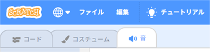
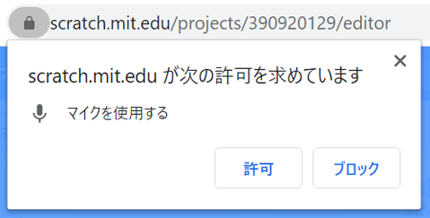
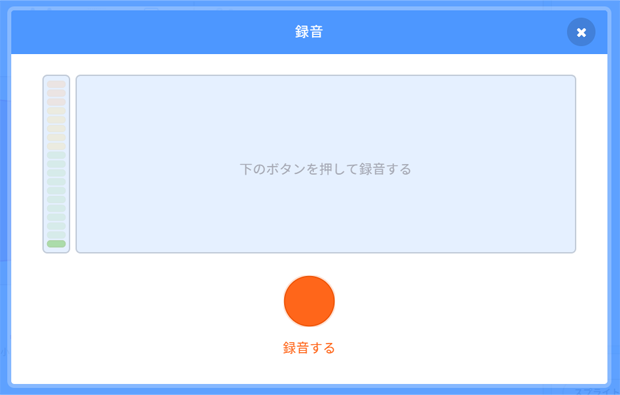

## 音声を追加する

--- task ---

スプライトの**音**タブを押します。



--- /task ---

--- task ---

画面の左下隅にある**音を選ぶ**ボタンにマウスカーソルを合わせ、**録音する**を選んで新しい音声を録音します。


--- /task ---

--- task ---

ウェブブラウザがマイクにアクセスできるように許可する必要があるかもしれません。 マイクを使えるようにするには、**許可**を押します。



タスク

--- task ---

**録音する**ボタンを押して、音声の録音をはじめましょう。 電子グリーティング・カードを受けとる人へのメッセージが完了したら、**録画をやめる**を押し、**保存**を押します。



--- /task ---

--- task ---

音声を再生するには、アニメーションの繰り返しが始まるところで`送る`{:class="block3control"}ブロックを使います。

```blocks3
when flag clicked
switch costume to (ezgif v)
set size to (150) %
forever
+broadcast (message1 v)
repeat (35)
next costume
```

--- /task ---

--- task ---

そして、`受け取ったとき`{:class="block3control"}ブロックを使って音声の再生を始めます。

```blocks3
when I receive (message1 v)
play sound (recording1 v) until done
```

--- /task ---

--- task ---

`待つ`{:class="block3control"}ブロックを使って、音声の再生をいつ始めるかを変えることもできます。

```blocks3
when I receive (message1 v)
+wait (0.4) seconds
play sound (recording1 v) until done
```

--- /task ---


