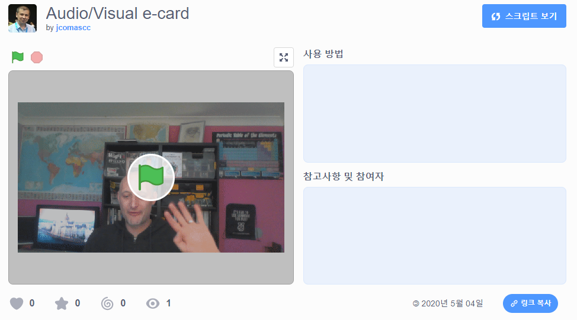

## 소개

이 프로젝트에서는 Scratch를 사용하여 친구와 가족에게 보낼 수 있는 시청각 전자 카드를 만들 것입니다.

### 만들 작품

--- no-print --- 전자 카드를 보기 위해 녹색 깃발을 클릭하세요. <iframe src="https://scratch.mit.edu/projects/419313682/embed" allowtransparency="true" width="485" height="402" frameborder="0" scrolling="no" allowfullscreen></iframe>

--- /no-print ---

--- print-only ---  --- /print-only ---

--- collapse ---
---
title: 준비물
---
### 하드웨어

- 웹캠과 마이크가 있는 컴퓨터
- 인터넷

### 소프트웨어

- 스크래치 3 ([온라인](http://rpf.io/scratchon) 또는 [오프라인](http://rpf.io/scratchoff))
- 웹 브라우저

--- /collapse ---

--- collapse ---
---
title: 배울 내용
---

- 비디오를 GIF로 변환하는 방법
- 스크래치에서 GIF를 움직이게 하는 방법
- 애니메이션에 소리를 추가하는 방법

--- /collapse ---

--- collapse ---
---
title: 교육자를 위한 추가 정보
---

이 프로젝트를 인쇄하기 위해서는 [프린트용 버전](https://projects.raspberrypi.org/en/projects/av-e-card/print){:target="_blank"}을 사용해 주십시오.

--- /collapse ---
